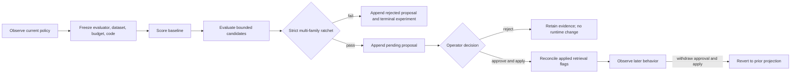

# H2 Improvement Experiments

Status: working single-node production-shaped slice. The experiment contract,
evidence ledger, proposal gate, explicit apply, and revert path are implemented.
Distributed scheduling and worker leasing are deliberately a later control-plane
phase.

## Purpose

SEAM may search for a better policy, but it must not treat "the search found a
higher number" as permission to change production. An improvement claim means:

> A bounded candidate passed a named, versioned evaluation contract against a
> fixed dataset and budget, without violating the strict ratchet.

That is proof relative to the declared contract. It is not universal proof that
a change is beneficial for every workload. Permanent application remains a
separate operator decision.

The loop borrows the useful control shape from Karpathy's
[AutoResearch](https://github.com/karpathy/autoresearch): keep the evaluator
fixed, bound the editable/candidate surface, compare against a baseline, and
retain the result of every attempt. SEAM does not download and execute arbitrary
candidate code. Its first lane enumerates allowlisted `RetrievalFlags` changes
and runs them counterfactually through the existing H2 scorers.

## Control flow



There are three independent boundaries:

1. **Experiment:** evaluates counterfactual candidates and records evidence.
2. **Proposal:** the strict ratchet either rejects the candidate or leaves it
   pending for review.
3. **Application:** only an explicitly approved, non-violating proposal with a
   passing stored ratchet can change the persisted retrieval-flag projection.

`--auto-approve` remains a compatibility option, but cannot cross the operator
boundary.

## Durable evidence contract

`seam_runtime/improvement_experiments.py` owns contract
`improvement-experiment/1`. `SQLiteStore` persists:

- one immutable experiment definition containing the lane, method, baseline,
  evaluator, dataset, candidate space, budget, and code fingerprints;
- an append-only event sequence for `started`, baseline evaluation, every
  candidate evaluation, proposal linkage, completion, or sanitized failure;
- a SHA-256 chain in which every event commits to its predecessor, while the
  definition hash commits to every immutable definition column;
- full aggregate/category/per-case numeric evidence, but no prompts, queries,
  source text, answers, provider payloads, credentials, or hidden reasoning.

Failed and non-winning candidates are first-class evidence. They are not
discarded merely because no proposal was created. The first append after a
store opens (and any append whose head differs from the verified in-process
head) validates the complete chain. Later appends validate the immutable
definition, current tail, new link, and state transition inside an immediate
SQLite transaction. Explicit `--verify` always scans the complete chain, and a
failed verification invalidates the cached head so later appends fail closed.

The current core projection is `core-storage/3`; an exact registered
`core-storage/2 -> /3` migration installs the ledger without rewriting existing
proposal or retrieval state.

## Operator workflow

Run a bounded free cycle:

```bash
seam --db seam.db improve cycle \
  --experiment-label "nightly retrieval policy" \
  --max-candidates 64
```

List experiments or inspect and verify one complete chain:

```bash
seam --db seam.db improve experiments --status completed --limit 20
seam --db seam.db improve experiments --id <experiment-id> --verify
```

Review the linked proposal, then make the independent operator decision:

```bash
python -m tools.h2.improvement_review list --db seam.db --json
python -m tools.h2.improvement_review show --db seam.db <proposal-id>
python -m tools.h2.improvement_review approve --db seam.db <proposal-id> \
  --actor <operator>
python -m tools.h2.improvement_review apply --db seam.db --dry-run
python -m tools.h2.improvement_review apply --db seam.db
```

To reverse an applied policy, append a rejecting/superseding operator decision
and run `apply` again. Applied state is a reconciled projection of currently
approved proposals, so withdrawn flags are removed rather than accumulated.

Paid judged validation remains outside the always-on loop and still requires a
fresh explicit `--confirm-paid` invocation.

## Current safety and scale boundary

The working slice is suitable for one process or one serialized worker per
SQLite store:

- deterministic candidate generation with a 128-candidate hard safety cap;
  the default evaluates the complete bounded space, while an explicit lower
  limit records that truncation in both the definition and report;
- fixed evaluator, case-content, case-ID, budget, baseline, and code
  fingerprints;
- durable partial progress after each completed candidate;
- fail-closed hash/state verification and content-free failure records;
- no counterfactual mutation of applied flags;
- strict multi-family ratchet plus explicit approval/apply/revert.

It is not yet a horizontally distributed experiment service. Production scale
should extend this contract rather than bypass it:

1. add a scheduler and a versioned queue/lease protocol with idempotency keys,
   heartbeats, expiry, retry ceilings, and crash resume;
2. register immutable evaluator/dataset artifacts by digest and refuse workers
   that cannot reproduce them;
3. isolate candidate execution by lane, enforce wall-time/resource/spend
   budgets, and never grant a retrieval-policy worker arbitrary source edits;
4. add canary observation windows and automatic rollback proposals while
   retaining explicit operator authority for permanent application;
5. add retention/compaction for numeric event evidence without breaking the
   definition and event-chain verification contract;
6. migrate the same logical contract to the hosted transactional store when
   more than one writer must coordinate across machines.

New lanes—PACK policy, graph construction, prompts, or approved framework
adapters—must each define an allowlisted candidate schema, fixed evaluator,
holdout boundary, resource budget, and reversible apply adapter before they may
participate. A framework being popular or published is evidence to test it, not
proof that SEAM should install it.
