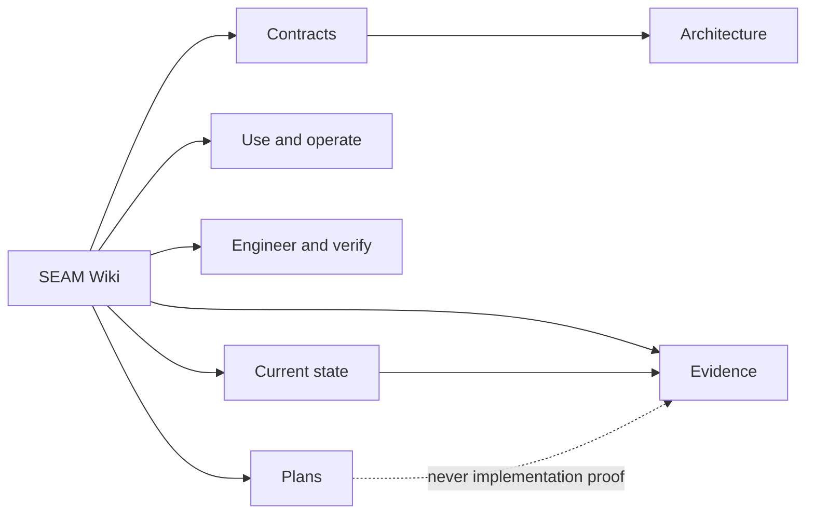

# SEAM Wiki

This page is the **single canonical SEAM Wiki home**. It is a human-facing
navigation layer over the repository's existing sources of truth, not a second
place to maintain product claims, project status, benchmark results, or plans.

Use the route that matches the job in front of you. For exhaustive page
coverage, open the [documentation map](DOCUMENTATION_MAP.md).

## Choose a route

| I want to... | Start here | Then use |
| --- | --- | --- |
| Understand what SEAM is | [SEAM governing specification](../SEAM_SPEC_V0.1.md) | [MIRL v1 contract](MIRL_V1.md) and [engineering architecture](engineering/01_ARCHITECTURE.md) |
| Install and use SEAM | [Operator guide](SEAM_OPERATOR_GUIDE.md) | [Setup](setup.md), [how-to runbooks](howto/README.md), and [troubleshooting](errors.md) |
| Understand the architecture | [Engineering manual](engineering/README.md) | [RAG architecture](RAG_ARCHITECTURE.md), [knowledge graph](KNOWLEDGE_GRAPH.md), and [reasoning graph](REASONING_GRAPH.md) |
| Engineer or verify a change | [Engineering change SOP](engineering/06_ENGINEERING_CHANGE_SOP.md) | [Codex agent orchestration](SOP_AGENT_ORCHESTRATION.md), [verification matrix](engineering/VERIFICATION_MATRIX.md), [test and benchmark SOP](engineering/07_TEST_AND_BENCHMARK_SOP.md), and [code layout](CODE_LAYOUT.md) |
| Find current state or plans | [Status streams](status/index.md) | [Project-status headline router](../PROJECT_STATUS.md), [workspace inventory](status/workspace.md), [derived roadmap state](../.seam/streams/roadmap/state.md), and [roadmap collection](roadmap/README.md) |
| File or find reports, evidence, or history | [Reports and evidence](REPORTS_AND_EVIDENCE.md) | [Audit registry](audits/INDEX.md), [history index](../HISTORY_INDEX.md), [current handoff](handoffs/INDEX.md), and [data routing](DATA_ROUTING.md) |
| Research memory systems or benchmarks | [Retrieval knowledgebase](kb/README.md) | [Benchmark SOP](BENCHMARK_SOP.md), [retrieval evaluation](RETRIEVAL_EVAL_V1.md), and [benchmark run records](BENCHMARK_RUN_RECORDS.md) |
| Work on branding or product surfaces | [Branding hub](../branding/README.md) | [Canonical identity kit](../branding/kit/README.md), [cosmic UI kit](../branding/canticle-cosmic-kit/README.md), and [surface status](status/surfaces.md) |

## Authority legend

The authority-by-claim-type model and evidence vocabulary live in the
[engineering manual](engineering/README.md#authority-order). Use these labels
without promoting a weaker source into a stronger claim:

| Label | Authoritative route |
| --- | --- |
| **Contract** | [SEAM specification](../SEAM_SPEC_V0.1.md) and [MIRL v1](MIRL_V1.md) define required product behavior and representation contracts. |
| **Implemented** | [Active code](CODE_LAYOUT.md) is evidence that behavior exists; check the exact implementation. |
| **Tested** | Named tests and the [verification matrix](engineering/VERIFICATION_MATRIX.md) establish only the property and scope they exercise. |
| **Measured** | Reproducible benchmark artifacts, [run records](BENCHMARK_RUN_RECORDS.md), and focused [audits](audits/INDEX.md) support measurement claims. |
| **Operational policy** | [AGENTS.md](../AGENTS.md), the [repo ledger](../REPO_LEDGER.md), and current operator procedures govern repository work. |
| **Planned** | [Roadmaps](roadmap/README.md) describe intended work; they are not implementation evidence. |
| **Experimental** | A page must say so explicitly; verify it against active code and tests before relying on it. |
| **Known gap** / **Unknown** | Follow the bounded investigation and abstention rules in [epistemic calibration](engineering/09_EPISTEMIC_CALIBRATION.md). |
| **Historical** | [Archived material](archive/README.md) is provenance only and must not guide current operation. |

## Documentation collections

- [Complete documentation map](DOCUMENTATION_MAP.md) — progressive-disclosure
  inventory of every active Markdown page under `docs/`.
- [Standard operating procedures](SOP_INDEX.md) — operator procedures and
  bounded execution packets, with historical material marked.
- [Engineering manual](engineering/README.md) — architecture, change control,
  security, verification, incidents, calibration, and templates.
- [Roadmaps](roadmap/README.md) — authored future direction, never current-state
  or implementation proof.
- [Prompt library](prompts/README.md) — reusable task packets, never evidence
  that their requested work ran.
- [Topic ledgers](ledgers/README.md) — stable routed facts; chronology remains in
  history.
- [Status streams](status/index.md) — current state by area.
- [Reports and evidence](REPORTS_AND_EVIDENCE.md) — the canonical storage and
  routing rule for human-readable reports, raw artifacts, and derived summaries.
- [Audit registry](audits/INDEX.md) — recorded review and measurement evidence.
- [Handoff registry](handoffs/INDEX.md) — the single current recovery head and
  its supersession chain.
- [Retrieval knowledgebase](kb/README.md) — memory-system research, benchmark
  traps, and measured lever history.

## Keep the wiki truthful

- Link to authoritative material instead of copying volatile counts, stage
  status, benchmark scores, or one-session findings.
- A roadmap or prompt is not proof that code exists or that work ran.
- A historical result is not proof that the current tree still behaves the
  same way.
- Put current state in the status system, chronology in history, stable policy
  in the repo ledger, and implementation evidence in code, tests, and artifacts.
