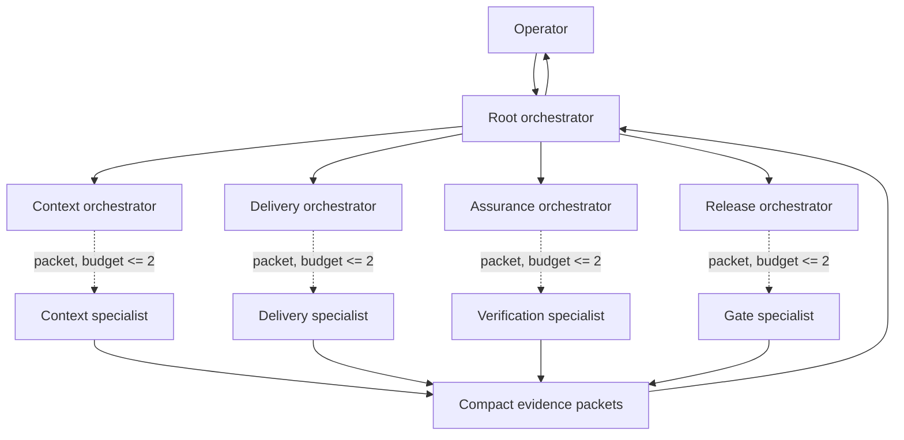

# SOP — Codex Root-Supplied Agent Orchestration

Issued: 2026-08-31
Authority: `AGENTS.md` and `REPO_LEDGER.md`
Schemas: `tools/agents/schemas/`

## Purpose

Use [Continuing SEAM work with Codex](SOP_SEAM_CODEX_WORKFLOW.md) when the
operator asks to continue, resume, repair, or complete a SEAM initiative. That
runbook owns the end-to-end sequence; this SOP owns the agent topology, packet,
session-state, guardian, and closeout mechanics used within its waves.

This SOP applies only to Codex and its project-scoped custom agents. Claude, Gemini, DeepSeek,
and other LLMs keep their own orchestration styles and model-specific
configuration. They continue to share SEAM's repository safety, continuity,
and Git policy, but this topology and packet protocol do not govern their agent
trees.

Codex uses specialists as temporary faculties of one root-owned initiative.
The Codex root reads repository continuity and governing contracts once, keeps
the operator conversation and plan, and supplies each child with a bounded
context packet. A delegated Codex agent does not begin another cold repository
session.

This is context delegation, not context duplication. Agents do not literally
share a model context window. They share a root-curated context spine with
explicit source references, ownership, evidence, and return bounds.

## Topology



The four domain orchestrators are logical roles, not four always-running
processes. With three child slots, a normal wave is the root plus one domain
orchestrator and up to two specialists. Activate only the role needed by the
current dependency.

The maximum hierarchy is:

```text
root -> domain orchestrator -> specialist
```

Specialists cannot delegate. A domain orchestrator can delegate only when its
packet has a positive `specialist_budget`, and every child receives a smaller
packet rather than the parent conversation or repository startup set.

## Roles and authority

| Role | Owns | May write | Cannot own |
| --- | --- | --- | --- |
| Root | objective, operator dialogue, context spine, decomposition, integration, final judgment | integration worktree, local session state, continuity and PR artifacts | independent acceptance of its own claims |
| Context | supplied-contract reconciliation, dependency map, scoped unknowns | no | implementation or broad discovery |
| Delivery | one approved vertical slice, disjoint specialist ownership, red/green evidence | packet-owned paths | architecture, staging, history, or publication |
| Assurance | independent spec/test/security review of an integrated slice | no | silent repairs or qualification by assertion |
| Release | exact-state TDD, gate, continuity, and plan-alignment qualification | no; returns receipt to root | repairs, commits, pushes, merges, releases, or paid calls |

Root alone integrates, stages explicit paths, updates the temporal chain,
manages the PR, and decides whether evidence is admitted. A child result is
evidence, not repository truth.

## Root context spine

The root performs the canonical `AGENTS.md` Session Start once. It retains only:

- the operator objective, acceptance criteria, decisions, and unresolved
  questions;
- current branch, base SHA, ownership map, and dirty-state exclusions;
- governing contract conclusions and exact source references;
- a bounded history/context pack, never the full `HISTORY.md`;
- dependency and wave state;
- red/green receipts, verification outcomes, and integration decisions.

Before each delegation, the root creates a
`seam-agent-context-packet/v1` object matching
`tools/agents/schemas/context-packet.schema.json`. `supplied_context` contains
compact facts and stable references such as `path:line`, commit, history entry,
or artifact hash. `allowed_reads` names the only additional sources the child
may open. It must not contain `HISTORY.md` as a broad read.

The packet is sufficient when the child can finish without rediscovering
project state. If it is not sufficient, the child returns:

```text
MISSING_CONTEXT
task_id: <task>
needed:
- <one exact fact, source range, decision, or artifact>
why: <which acceptance criterion is blocked>
current_diff: <paths or none>
```

The root answers with a packet amendment. The child does not compensate with a
repo-wide scan.

## Context packet example

```json
{
  "schema": "seam-agent-context-packet/v1",
  "run_id": "agent-orchestration-20260831",
  "task_id": "delivery-hook-01",
  "parent_task_id": "root-01",
  "role": "seam_delivery_orchestrator",
  "base_sha": "780b3772c76281597ee3c6f6d07caa5adf284df2",
  "objective": "Implement the bounded SessionEnd request producer.",
  "acceptance_criteria": [
    "Runtime changes without red/green evidence become TDD_UNPROVEN",
    "The hook never reads a transcript or launches another model session"
  ],
  "non_goals": ["Run closeout inside the hook", "Modify user-owned dirty work"],
  "supplied_context": [
    {
      "ref": "AGENTS.md#Session-End",
      "digest": "Root already loaded the canonical closeout rules.",
      "facts": ["Local gates may not be weaker than required CI checks"]
    }
  ],
  "owned_paths": ["tools/agents/session_end_closeout.py"],
  "allowed_reads": ["tests/audit/test_session_end_agent_closeout.py"],
  "forbidden_reads": ["HISTORY.md", "archive/**", "unrelated worktrees"],
  "dependencies": [],
  "exact_commands": [
    "python3 -m pytest tests/audit/test_session_end_agent_closeout.py -q"
  ],
  "stop_if": ["A product or security decision is required", "Owned scope is insufficient"],
  "specialist_budget": 0,
  "return_contract": {
    "format": "SEAM_RETURN_PACKET/v1",
    "max_words": 500,
    "required_evidence": ["files changed", "red command", "green command", "risks"]
  }
}
```

## Execution pipeline

1. **Root frame.** Reconcile live Git/worktree state, load canonical startup
   sources once, record the objective and acceptance criteria, and identify
   user-owned exclusions.
2. **Context wave.** Use `seam_context_orchestrator` only for a bounded contract,
   dependency, or unknown-resolution question. Root supplies the relevant
   extracts.
3. **Delivery wave.** Use `seam_delivery_orchestrator` for one independently
   green vertical slice. Every writable specialist receives disjoint paths.
4. **Assurance wave.** After integration, use `seam_assurance_orchestrator` with
   the spec digest, diff paths, tests, and claimed evidence. It reports; the
   root assigns any repair as a new delivery packet.
5. **Release wave.** Use `seam_release_orchestrator` on an exact-state request.
   The root validates and atomically stores its receipt, then performs any
   authorized continuity, PR, or publication action.

The root evaluates context usage at coherent work boundaries with
`python -m tools.agents.context_guardian`. It updates a durable checkpoint from
45%, emits `COMPACT_AT_MILESTONE` or `COMPACT_NOW` from 65%, and writes a
successor handoff plus emits `HANDOFF_REQUIRED` at 82%. Two recorded
compactions also force `HANDOFF_REQUIRED`. The helper cannot compact a model
context window itself; it makes the required action and durable state explicit.

## Session state and TDD evidence

During a repo-changing root session, maintain the ignored file:

```text
.seam/orchestration/sessions/$CODEX_SESSION_ID.json
```

It must match `seam-agent-session-state/v1`. Keep the objective, base SHA,
current plan, constraints, affected tests, and witnessed TDD cycles. Do not
copy prompts, transcript text, hidden reasoning, credentials, or private URLs.

Initialize it with the tracked helper (repeat `--plan`, `--constraint`, and
`--affected-test` as needed):

```bash
python -m tools.agents.session_state init \
  --objective "<operator objective>" \
  --plan "<current step>" \
  --constraint "<hard boundary>" \
  --affected-test "<test path>"
```

After witnessing one red/green cycle, append it with
`python -m tools.agents.session_state record-tdd --help`. The helper refuses a
zero red exit, a non-zero green exit, oversized state, and secret-shaped or
private-link content.

Each TDD cycle records one public behavior and:

- exact red command, non-zero exit, timestamp, and output fingerprint;
- exact green command, zero exit, timestamp, and output fingerprint;
- test references and the runtime paths the cycle covers.

Passing tests do not prove TDD. A runtime path without a complete recorded
cycle is `TDD_UNPROVEN`.

## Context guardian

Observe current usage with bounded summary items and one concrete resume step:

```bash
python -m tools.agents.context_guardian \
  --session-id "$CODEX_SESSION_ID" \
  observe \
  --used-tokens <used> \
  --context-limit <limit> \
  --summary "<durable completed or in-flight fact>" \
  --next-step "<first exact successor action>"
```

Add `--at-coherent-milestone` only when the current atomic slice is safe to
compact. After the actual context compaction completes, record it with:

```bash
python -m tools.agents.context_guardian \
  --session-id "$CODEX_SESSION_ID" record-compaction
```

Guardian state and checkpoints live under ignored
`.seam/orchestration/context/`; successor handoffs live under ignored
`.context-handoffs/`. Artifacts are atomically written with mode `0600`, are
bounded to 256 KiB, and reject secret-shaped, private-link, multiline, unsafe
identity, symlinked-state, and invalid lifecycle content.

## SessionEnd hook

The tracked `.codex/hooks.json` adds a project `SessionEnd` command. User-global
hooks remain additive. Codex requires the operator to trust a new or changed
project hook before it runs; never bypass that trust check for convenience.

The command `tools/agents/session_end_closeout.py`:

1. checks the recursion guard before any I/O;
2. validates `session_id` and that `cwd` is inside this Git root;
3. reads Git metadata plus the bounded root session-state record;
4. classifies changed paths and evaluates recorded TDD coverage;
5. embeds the bounded red/green cycle records so release can recompute the TDD
   summary and changed-runtime-path coverage independently;
6. writes one permission-restricted, fingerprint-keyed request under
   `.seam/orchestration/session-end/requests/`; and
7. exits within the hook timeout.

It does not read the Codex transcript, run tests, call
`tools.history.closeout`, modify history, or start nested `codex exec` work.
Those operations are too slow, mutable, and recursion-prone for shutdown.

At the next root Session Start, every request without a validated `QUALIFIED`
receipt is a mandatory release wave before new writes. The root supplies the request to
`seam_release_orchestrator`, confirms that its head and diff fingerprint still
match, validates its `seam-agent-closeout-receipt/v1` result, and stores it at
the request's `receipt_path`. A non-qualified first verdict remains immutable;
later retries are stored as content-addressed records under
`.seam/orchestration/session-end/receipt-attempts/`. When a repair changes the
diff fingerprint, the `QUALIFIED` receipt for the newer exact-state request
lists the older reviewed request IDs in `supersedes_request_ids`. The successor
may have a new Codex session ID, but it must remain in the same repository,
worktree, and branch lineage.

List validated requests without launching a model:

```bash
python -m tools.agents.closeout_queue pending
```

After the read-only release orchestrator returns receipt JSON, the root admits
it only through the validator and no-clobber atomic writer:

```bash
python -m tools.agents.closeout_queue store \
  --request <queued-request.json> \
  --receipt <candidate-receipt.json>
```

Receipt storage requires a stable repeated live-worktree HEAD, changed-path,
and content fingerprint immediately before publication. That final stable
verification is the receipt's point-in-time exact-state boundary; it does not
lock arbitrary editors. A receipt that merely echoes a stale request is
rejected, and any later worktree mutation requires the root to create a new
request and repeat qualification before merge.

The queue rejects oversized, malformed, symlinked, hash-mismatched,
scope-mismatched, authority-expanding, incomplete-check, or conflicting
records. A byte-equivalent existing receipt or attempt is idempotent. Receipt
records are never overwritten or deleted, and a later `QUALIFIED` attempt may
supersede prior non-qualified evidence. Supersession is admitted only for older
requests in the same repository/worktree/branch lineage that already have a
validated non-qualified verdict; content-addressed attempt names are re-derived
and verified during reads. Once any validated receipt is
`QUALIFIED`, its own request and every explicitly superseded request leave the
pending queue. The queue never launches a model, runs a check, or repairs the
worktree.

Receipt meaning:

- `QUALIFIED`: exact scope matches; TDD is proven or not required; every
  required test/gate and continuity check passed; work aligns with the plan.
  It may explicitly supersede older reviewed exact-state requests from the same
  repository lineage.
- `NOT_QUALIFIED`: an executed check failed or required TDD evidence is absent.
- `BLOCKED`: an external dependency or authority boundary prevented a required
  check.
- `INDETERMINATE`: state drift, missing context, or incomplete evidence makes a
  safe verdict impossible.

Only `QUALIFIED` supports a closeout claim. Other statuses name one concrete
next action and remain pending evidence for the root.

## Collision and safety rules

- One writable owner per path and wave. Use separate worktrees for concurrent
  implementation branches.
- Specialists inherit only their child packet, not the full conversation.
- Root stages explicit paths; never `git add -A`.
- No agent repairs, expands scope, invokes paid providers, pushes, merges, or
  releases unless its packet and operator authority explicitly allow it.
- Raw agent output is not admitted to MIRL automatically. The root selects
  reviewed facts and provenance under the existing SEAM admission contract.
- A new agent profile is discoverable only after Codex reloads project config;
  file creation is not proof that the current client loaded or executed it.

## Verification

```bash
python3 -m pytest \
  tests/audit/test_agent_session_state.py \
  tests/audit/test_session_end_agent_closeout.py \
  tests/audit/test_closeout_queue.py \
  tests/audit/test_context_guardian.py \
  tests/audit/test_codex_agent_profiles.py \
  tests/audit/test_history_closeout.py \
  tests/audit/test_local_gates_match_ci.py -q
python3 /home/terrabyte/.codex/skills/forge-specialists/scripts/forge_team.py \
  validate --agent-dir .codex/agents
```

Project hook discovery and trust must also be smoke-tested in a fresh Codex
session before claiming the hook is installed. Until that operator trust event,
the tracked configuration is implemented but not active.
