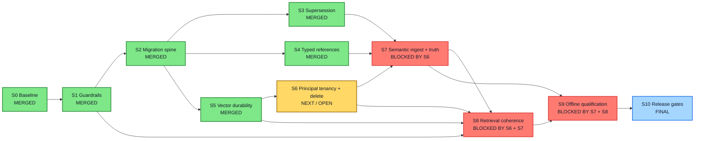
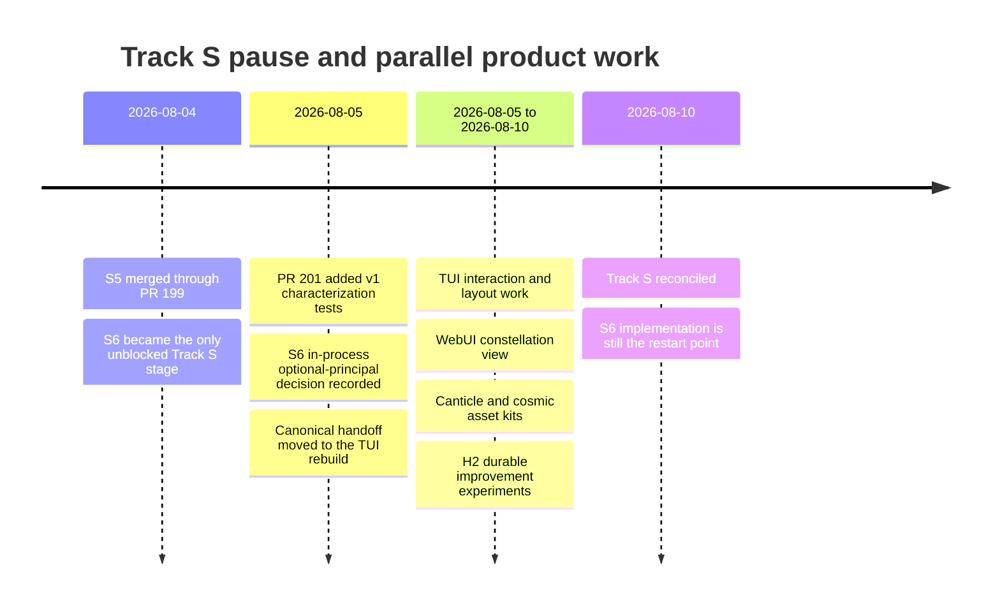
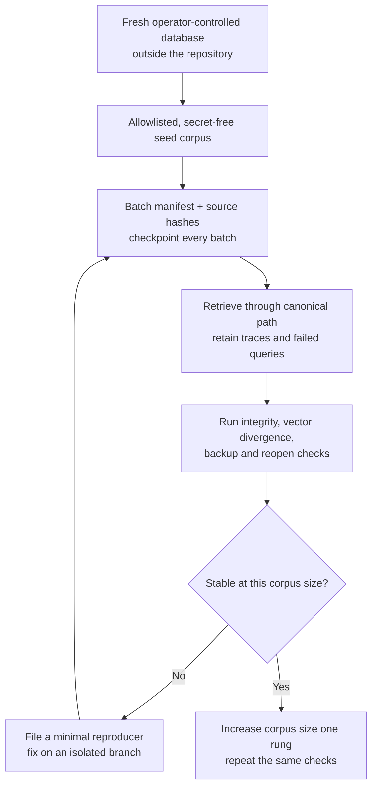
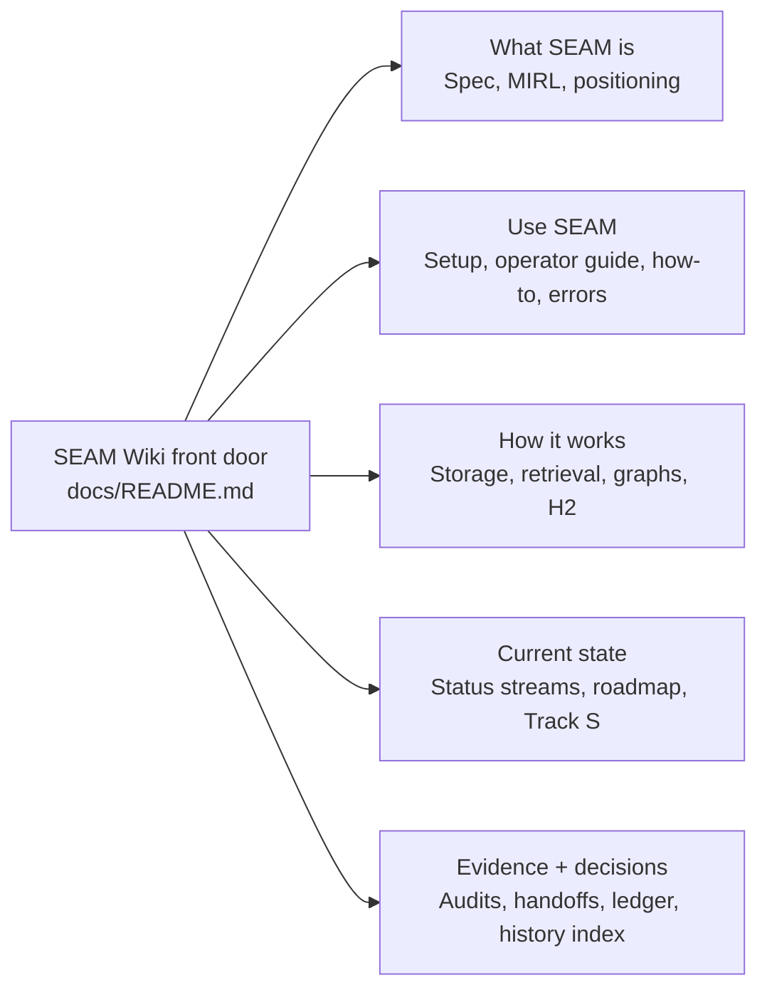

# Track S Visual Status Report — 2026-08-10

**Scope:** read-only status reconciliation followed by this documentation
record. **Repository:** `BlackhatShiftey/Seam`. **Observed main:**
`2f4af74be2fdb553447d3f736afb4e0292906d76`. **Campaign:** S0 through S10,
eleven stages total; there is no active S11.

**Canonical record:** this report is stored under `docs/audits/` and registered
newest-first in the [SEAM Audit Registry](INDEX.md). The registry's `latest`
field identifies the current recorded audit; this report is a scoped status
reconciliation, not a whole-repository health audit.

## Executive verdict

Track S is **not finished**. S0-S5 are merged and remain ancestors of current
`main`. S6-S10 are open. The work paused after S5 while the repository shifted
through `/v1` characterization, the S6 design decision, TUI/WebUI work,
branding, and H2 improvement experiments.

That boundary does **not** prevent controlled, single-user local dogfooding.
It does prevent a dependable hosted multi-tenant claim, default-on semantic
graph/scorer promotion, and a release-qualified production claim.

The dependency order above is the authored campaign contract, not an inferred
sequence. See [the campaign dependency graph](../roadmap/MEMORY_GUARANTEES_CAMPAIGN.md#dependency-order).

## What has landed

| Stage | Result now on `main` | Publication evidence |
| --- | --- | --- |
| S0 | Clean canonical replacement baseline | [PR #190](https://github.com/BlackhatShiftey/Seam/pull/190), `778de2c` |
| S1 | Immediate deterministic and fail-closed guardrails | [PR #191](https://github.com/BlackhatShiftey/Seam/pull/191), `ebbf2f3` |
| S2 | Transactional, recoverable migration spine | [PR #193](https://github.com/BlackhatShiftey/Seam/pull/193), `6b7c22d` |
| S3 | Durable supersession and guarded graph reprojection | [PR #194](https://github.com/BlackhatShiftey/Seam/pull/194), `9bd40cb` |
| S4 | Typed-reference and orphan-integrity contract | [PR #195](https://github.com/BlackhatShiftey/Seam/pull/195), `ea4e46e` |
| S5 | Durable vector outbox, pooled committed snapshots, no read-path DDL | [PR #199](https://github.com/BlackhatShiftey/Seam/pull/199), `19b3a76` |

The intervening security/determinism repair also landed through
[PR #196](https://github.com/BlackhatShiftey/Seam/pull/196) at `67d9c7c`.

## Remaining tiers

### S6 — Principal tenancy and opaque deletion

**What it buys:** the boundary between a trusted single-user runtime and a
hosted service where one caller must never name or retrieve another caller's
memory.

**Already present:** the operator selected **in-process tenancy with an optional
principal**. The lifecycle engine already has tenant-aware deletion,
idempotency, append-only audit events, recoverable cleanup, and runtime entry
points. `/v1` also has characterization coverage from
[PR #201](https://github.com/BlackhatShiftey/Seam/pull/201).

**Still missing:** principal propagation through `server.py` and
`public_api.py`; principal-derived internal namespaces; an opaque `/v1` delete
route; a two-principal denial matrix; proof that authenticated paths never use
an absent namespace; proof that public responses leak neither tenant prefixes
nor private MIRL/retrieval shapes. The current characterization test deliberately
proves that one bearer token can read any namespace it names.

**Dogfood boundary:** does not block trusted, single-user local use. It blocks
shared hosted or multi-tenant use.

Authoritative gate: [S6](../roadmap/MEMORY_GUARANTEES_CAMPAIGN.md#s6---principal-tenancy-and-opaque-deletion).

### S7 — Semantic ingest, temporal reconciliation, and entities

**What it buys:** trustworthy semantic relations and entities whose meaning,
time, and evidence survive ingestion, reconciliation, concurrency, and as-of
retrieval.

**Already present:** canonical MIRL, typed references, guarded graph
reprojection, lifecycle/supersession truth, and a limited research relation
lane.

**Still missing:** qualifying REL admission with exact SPAN-to-RAW proof;
functional versus multivalued predicate reconciliation; correct older/newer,
equal-time, and missing-time behavior; complete concurrency/idempotency/as-of
proof; 100 percent exact retrieved-entity evidence; and robust multiword and
same-name entity separation.

**Dogfood boundary:** does not block basic RAW/MIRL ingestion and retrieval. It
does block treating automatically inferred semantic topology as fully
qualified truth.

Authoritative gate: [S7](../roadmap/MEMORY_GUARANTEES_CAMPAIGN.md#s7---semantic-ingest-temporal-reconciliation-and-entities).

### S8 — One retrieval engine, coherent fusion, events, and identity

**What it buys:** the same ranked memory result from every shipped surface,
with one coherent fusion policy and one auditable retrieval event.

**Already present, but not sufficient for promotion:** `RetrievalOrchestrator`
is the architectural owner and `SeamRuntime.retrieve()` is the canonical entry
point. A legacy-policy plan executes only the legacy adapter
(`tests/audit/test_retrieval_consolidation.py:67-115`). Accepted identity merges
are reversible and retain their audit evidence
(`seam_runtime/identity_resolution.py:337-443`,
`tests/audit/test_identity_resolution.py:125-159,577-649`). Those two S8 clauses
are implemented and tested; their presence does not satisfy S8's remaining
dependencies or promote the stage.

**Still missing or unqualified:** direct-runtime IDs/order parity across every
shipped surface; exact replay and persistence for absent/all-one/zero/non-unit
leg weights; fail-closed unknown leg names; and exactly one tenant-scoped event
per successful enabled retrieval without telemetry changing the answer. The
current retrieval status records legacy hardcoding around `search_ir()`, a
fusion-policy identifier mismatch, unvalidated live-graph weights, and the open
surface/event qualification boundary (`docs/status/retrieval.md:9-22,76-84`).

**Dogfood boundary:** use the canonical retrieval entry point and traces for
debugging now, but do not claim perfect surface parity or a promoted weighted
fusion policy.

Authoritative gate: [S8](../roadmap/MEMORY_GUARANTEES_CAMPAIGN.md#s8---one-retrieval-engine-coherent-fusion-events-and-identity).

### S9 — Provider-free retrieval and semantic qualification

**What it buys:** evidence that the promoted retrieval/semantic configuration
works on a complete offline corpus and that any graph contribution is real,
attributable lift rather than extra machinery.

**Already measured, but not promoted:** `HISTORY#509` records one pristine
ingest-only snapshot, an independent clone for each arm, and four provider-free
1,542-question runs with zero errors and no network. Canonical scored `0.776048`
versus legacy `0.766420` overall, but category-level non-regression failed —
including cat3 at `-0.036775`. The current status preserves that matched result
and its boundary (`docs/status/retrieval.md:24-47,64-88,98-101`). The cloning
method and full-corpus run therefore exist; they are measured evidence, not a
passed S9 promotion gate.

**Still missing or failed:** category-level non-regression; a frozen-candidate
proof of complete offline embedding coverage and deterministic retained traces;
a graph-eligible corpus with enough supported relations and perfect provenance
completeness; human precision review; and a fresh matched graph-only ablation.
Until those clauses pass together, graph/scorer behavior remains default-off.

**Dogfood boundary:** does not block debugging. It blocks default-on graph or
scorer promotion and broad quality claims.

Authoritative gate: [S9](../roadmap/MEMORY_GUARANTEES_CAMPAIGN.md#s9---provider-free-retrieval-and-semantic-qualification).

### S10 — Required CI and release gates

**What it buys:** a frozen candidate whose code, migrations, tenancy,
retrieval, artifacts, privacy boundary, history, and release evidence all pass
together.

**Still missing:** final zero-skip non-external and live-pgvector suites over
the completed S0-S9 candidate; focused migration/crash/tenancy/semantic/
retrieval gates; clean hermetic wheel and sdist proofs; final secret/session and
review closeout; complete continuity gates; and promotion of
`test-and-benchmark` from advisory to required. Publication remains a separate
operator decision.

**Dogfood boundary:** does not block local use. It blocks a release-qualified
or hosted-production-ready claim.

Authoritative gate: [S10](../roadmap/MEMORY_GUARANTEES_CAMPAIGN.md#s10---required-ci-and-release-gates).

## Where the detour happened

The detour did not erase or abandon Track S. The roadmap continues to mark it
`in-progress`, but the canonical handoff changed to the TUI and never returned
to the S6 boundary.

## Dogfooding runway

The following is an **operational proposal**, not a completed Track S stage or
benchmark claim.

Recommended boundaries:

- Never ingest `.env`, credentials, private keys, provider session links, or
  unreviewed secret-bearing directories.
- Keep the dogfood database and generated artifacts outside the Git worktree.
- Start from a fresh database, retain the pristine seed snapshot, and preserve
  batch manifests so a failure can be reproduced.
- Treat current graph/scorer behavior as observational unless and until S7-S9
  pass; use traces to discover defects rather than to make promotion claims.
- Continue local single-user ingestion while S6 is built separately. Do not
  expose that database as a shared hosted service.

## Parallel-work continuity rule

Conversation isolation and file isolation solve different problems.

| Situation | Conversation action | Repository action |
| --- | --- | --- |
| Same goal, new constraint | Stay in the current chat | Stay on the owned branch/worktree |
| Short question with no file changes | Use `/side` | No new worktree |
| New goal that should preserve the current thread | Use `/fork` | If it edits code/docs, create a separate branch and worktree |
| Two efforts may touch the same files | Fork before implementation | Assign file ownership or serialize the dependency; never edit concurrently in one checkout |
| Finished slice | Return a compact evidence packet | Commit, push, PR, merge in dependency order, then remove the worktree/branch |

Codex documents `/fork` as cloning the current chat under a new ID while
leaving the original transcript untouched, and `/side` as an ephemeral focused
detour. A conversation fork alone does not provide Git isolation. This command
behavior was checked against the current Codex CLI manual during the report;
the external documentation URL is intentionally omitted from the repository's
tracked audit record under SEAM's private-session-link policy.

SEAM still permits exactly **one current canonical handoff head**. Parallel
branches should report their local state in their branch, PR body, and HISTORY
entry; they must not create competing current handoff heads. The merged
dependency boundary advances the canonical handoff.

## Wiki workstream

The wiki is a separate parallel goal and was not implemented as part of this
report. The safest initial shape is a human-facing navigation layer over
existing truth, not a duplicate truth tree:

Each wiki entry should say what question the linked document answers, whether
it is governing/current/historical, and when its status was last reconciled.
Canonical facts remain in their existing documents.

## Documentation drift discovered

The structural continuity gates pass, but several current-facing statements
are semantically stale:

- At this report's pinned `main@2f4af74`, the then-current
  `docs/roadmap/MEMORY_GUARANTEES_CAMPAIGN.md` header called S4 the latest
  evidence and directed S6 to start from `main@ea4e46e`, while its S5 section
  recorded S5 as published at `main@19b3a76` and as a dependency of every later
  stage. Following that historical header literally could have started S6 from
  a stale base that omitted S5; the active campaign has since been corrected.
- At that same pinned revision, the then-current `PROJECT_STATUS.md` and
  `docs/status/operations.md` said the S6 tenancy decision was unwritten and
  `/v1` had zero HTTP tests. The in-process optional-principal decision is now
  recorded at `docs/roadmap/MEMORY_GUARANTEES_CAMPAIGN.md:356-363`; HTTP
  characterization coverage is documented at
  `tests/audit/test_public_api_v1_http.py:1-12`, including the deliberately
  insecure one-token cross-namespace case at
  `tests/audit/test_public_api_v1_http.py:315-344`. Following the stale status
  could duplicate completed design/test work or misstate coverage. It does not
  change the fact that S6 principal binding and opaque deletion are unbuilt.
- `docs/handoffs/2026-08-05-tui-rebuild-canticle.md:19-20` and
  `docs/handoffs/2026-08-05-tui-rebuild-canticle.md:104-107` still direct the
  reader to wait for PR #203 and then merge the TUI branch, while
  `docs/CODE_LAYOUT.md:45-52` records that TUI as the live surface and
  `docs/status/surfaces.md:12-23` records its later interaction work. Following
  the stale handoff could restart from an already-merged prerequisite or treat
  shipped TUI work as an unmerged branch.

These are documentation repairs, not evidence that S6 implementation exists.
They should be handled as a bounded continuity correction before or alongside
the S6 implementation branch.

## Exact restart point

1. Create an isolated S6 branch/worktree from current protected `main`.
2. Reuse the existing lifecycle deletion engine; do not build a second tenancy
   or deletion model.
3. Replace the characterization test that proves one-token cross-namespace
   access with a two-principal denial matrix while preserving no-principal
   trusted-local compatibility.
4. Add the opaque `/v1` delete path and prove immediate retrieval exclusion,
   recoverable derived cleanup, idempotence, and immutable audit.
5. Land S6 with exact-head required and advisory CI before opening S7.
6. Run dogfooding in a separate operator-data lane and the wiki in a separate
   documentation worktree; neither should share S6's implementation checkout.

## Verification and evidence boundary

| Check | Exact command or inspection | Outcome |
| --- | --- | --- |
| Workspace identity | `git status --short --branch`; `git rev-parse HEAD`; `git rev-parse origin/main` | Initial tree clean on `agent/track-s-visual-report`; report head `27ded0dc98f369111fbb01ebb4ffb5d5e2703f9a`; observed `origin/main` `2f4af74be2fdb553447d3f736afb4e0292906d76`. |
| Published ancestry | `for c in 778de2c ebbf2f3 6b7c22d 9bd40cb ea4e46e 67d9c7c 19b3a76; do git merge-base --is-ancestor "$c" origin/main; done` | PASS, 7/7 exit zero: S0-S5 plus the intervening repair are ancestors of observed `main`. |
| GitHub publication | `for pr in 190 191 193 194 195 196 199 201; do gh pr view "$pr" --json number,state,mergedAt,mergeCommit; done` | PASS, 8/8 report `MERGED`; PR #201 is characterization preparation, not S6 implementation. |
| S6 surface boundary | <code>rg -n "principal&#124;@app\\.(post&#124;delete).*v1&#124;def (remember&#124;recall&#124;context&#124;delete)&#124;cross.namespace&#124;cross_namespace" seam_runtime/public_api.py seam_runtime/server.py tests/audit/test_public_api_v1_http.py</code> | Found `/v1` remember, recall, and context routes plus the characterization test that says S6 must add principal binding; found no principal-bound public API or opaque `/v1` delete route. |
| Diagram syntax | Mermaid 11.16.0 `mermaid.parse(...)` over every fenced `mermaid` block, driven by `google-chrome --headless=new --disable-gpu --no-sandbox --allow-file-access-from-files --virtual-time-budget=5000 --dump-dom file:///tmp/seam-pr211-mermaid-check.html` | PASS, 4/4 diagrams parsed; the temporary harness was removed. |
| Documentation integrity | `.venv/bin/python -m tools.history.verify_integrity`; `.venv/bin/python -m tools.history.verify_routing`; `.venv/bin/python -m tools.history.verify_handoffs`; `.venv/bin/python -m tools.history.verify_continuity`; `.venv/bin/python -m tools.streams.verify_streams` | PASS after the superseding correction entry and derived continuity artifacts were generated. |
| Patch hygiene | `git diff --check`; `.venv/bin/python -m tools.security.secret_scan --working-tree` | PASS; no whitespace errors, secret-shaped values, or private session URLs detected in the candidate changes. |

No runtime pytest slice, external pgvector service, provider call, benchmark,
ingestion/dogfood run, deployment, package release, or destructive cleanup was
run. Those checks are outside this documentation-only correction, and this
report makes no fresh runtime-quality, provider, benchmark, deployment, or
production-readiness claim from them.
