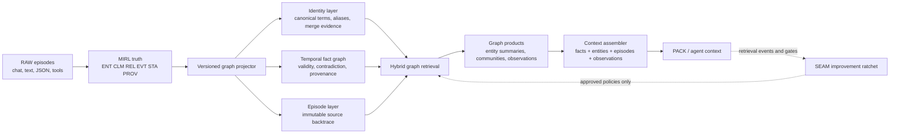

# SEAM Graph Memory Maturity

SEAM's graph is a projection of canonical RAW/MIRL, not a competing truth
store. Graph maturity therefore means improving identity, temporal relations,
retrieval, and context assembly while every served item remains traceable to
MIRL and exact source evidence.

## Target architecture

The identity, fact, and episode layers are independently queryable. Retrieval
may fuse their signals, but graph candidates must not silently displace the
primary evidence lane. PACK remains derived and disposable.

## Current position

Already present:

- atomic MIRL-to-SQLite graph projection;
- entity, assertion, source, agent, value, and episode nodes;
- typed semantic, provenance, epistemic, temporal, and 5W1H+Then edges;
- current and historical validity views, supersession, trust gating, namespace
  and scope isolation;
- exact episode/source-record backtraces and graph-backed CLI, REST, MCP, and
  dashboard surfaces.

Structural gaps:

- identity lookup has depended on labels and record IDs instead of a dedicated
  canonical term/alias index;
- entity resolution is exact-label only and has no reversible merge ledger;
- graph retrieval lacks one measured lexical + semantic + path fusion contract;
- entities have no durable evolving summaries; graph-wide communities and
  evidence-backed observations are absent;
- no first-class context block composes facts, entities, episodes, summaries,
  and observations under one trust/token budget;
- lifecycle, deletion, batch ingest, recovery, and load qualification are not
  yet complete as one graph product.

## Build sequence

| Stage | Deliverable | Acceptance boundary |
| --- | --- | --- |
| G1 Identity index | Versioned scoped canonical terms and explicit aliases; concept-aware source paths | Deterministic backfill, no assertion/source text in the identity index, no cross-scope matches, exact provenance |
| G2 Reversible resolution | Alias candidates, merge evidence, canonical-of links, undo/split path, conflict states | No silent destructive merge; old identities and supporting evidence remain auditable |
| G3 Hybrid path search | Lexical terms + semantic node/fact vectors + bounded traversal with explicit fusion trace | Stable ranking, current/history correctness, query-shape and latency fixtures |
| G4 Graph products | Evolving entity summaries, communities, community summaries, multi-episode observations | Every derived sentence names supporting record and episode IDs; trust gates fail closed |
| G5 Context assembly | Facts, entities, episodes, summaries, and observations packed by task, trust, time, and token budget | Exact refs/backtraces, non-displacement tests, deterministic budget behavior |
| G6 Lifecycle and scale | User/thread/graph APIs, scoped deletion, async/batch ingest, recovery, backend portability | Deletion audit, crash recovery, concurrency/load gates, no tenant leakage |
| G7 Qualification | Native SEAM and matched Mem0/Zep benchmark lanes plus scale and ablation suites | Separate scoreboards, frozen contracts, graph-component attribution, no borrowed claims |

Benchmarks remain qualification evidence throughout, but they no longer gate
whether the graph substrate may be built. Each stage first passes structural,
provenance, temporal, isolation, and determinism contracts; score movement is
measured after the corresponding graph capability exists.

## Competitor-shaped reference points

- Zep/Graphiti's useful target shape is temporal entity/fact edges, evolving
  entity summaries, raw episodes, ontology support, hybrid search, and assembled
  context types. SEAM should match the capability shape while retaining MIRL as
  canonical truth and stricter evidence/trust boundaries.
- Current Mem0 documentation describes entity linking as a first-class ranking
  signal in its newer retrieval architecture. The useful lesson for SEAM is a
  native scoped entity-term index feeding retrieval—not dependence on a separate
  graph database or an opaque relation array.

Primary references, checked 2026-07-22:

- <https://github.com/getzep/graphiti>
- <https://help.getzep.com/context-types>
- <https://docs.mem0.ai/migration/platform-v2-to-v3>

