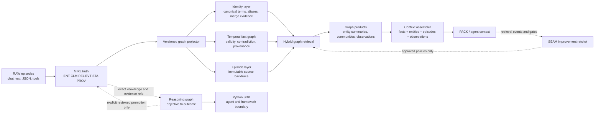

# SEAM Graph Memory Maturity

SEAM's knowledge graph is a projection of canonical RAW/MIRL, not a competing
truth store. It now grows beside an append-only reasoning graph that records
public run justifications without becoming canonical truth. Graph maturity
therefore has two parallel lanes: improve identity, temporal relations,
retrieval, and context assembly in G1-G7; improve inspectable reasoning,
verification, reuse, and reviewed promotion in R1-R6. The planes join through
exact references, never by silently promoting a conclusion into knowledge.

## Target architecture

The identity, fact, and episode layers are independently queryable. Retrieval
may fuse their signals, but graph candidates must not silently displace the
primary evidence lane. PACK remains derived and disposable.

## Current position

Already present:

- atomic MIRL-to-SQLite graph projection;
- entity, assertion, source, agent, value, and episode nodes;
- typed semantic, provenance, epistemic, temporal, and 5W1H+Then edges;
- current and historical validity views, supersession, trust gating, namespace
  and scope isolation;
- exact episode/source-record backtraces and graph-backed CLI, REST, MCP, and
  dashboard surfaces;
- G1 scoped canonical term and explicit alias indexing with provenance and no
  assertion/source-text leakage;
- G2 reversible identity merge proposals, evidence, acceptance, conflicts, and
  terminal split/undo history;
- R1 append-only run-scoped reasoning nodes, edges, state history, scoped
  knowledge/evidence references, and a local Python SDK boundary;
- R2 atomic retrieval decisions with bounded selected/rejected candidate
  ledgers, fixed planner/fusion identities, exact evidence IDs, and compact SDK
  reads;
- R3 append-only verification checks with result fingerprints, scoped evidence,
  immutable linear retries, compact reads, and atomic verified outcomes that
  retain exact supporting verification IDs;
- R4 append-only structural reasoning recipes distilled only from verified
  accepted outcomes, with task/operation retrieval, freshness and provenance
  gates, explicit reuse, and verified success/failure feedback that changes
  future trust and ranking without storing conclusions or hidden reasoning;
- R5 append-only promotion proposals from verified accepted outcomes, separate
  human/policy reviews, exact-provenance rechecks, explicit application into
  canonical MIRL, application fingerprints, and additive audited reversal;
- G3 provider-free semantic fact/episode MIRL seeds plus versioned semantic
  vectors for entity, value, agent, and symbol graph nodes feeding 0-3-hop
  graph traversal, deterministic lexical/vector/graph fusion, and explicit
  decision/latency traces. The `graph_node` leg is explicit in
  `reciprocal-rank-fusion/2`, so node-vector evidence is not hidden inside graph
  traversal. A semantic seed receives graph credit only after an
  in-boundary edge actually connects it. Each hop >=1 hit now carries its exact
  deterministic shortest edge path plus only the path episodes visible in the
  selected current, historical, or `at` time view; hop-0 seeds remain path-free.
  The time view is recorded in the append-only R2 retrieval decision.
  `reciprocal-rank-fusion/2` now makes cross-leg contributions comparable
  without comparing raw score domains, with a versioned stored fingerprint.
  The provider-free G3 qualification fixture covers 2,048 nodes and 2,047 edges
  across structured, 1-hop, 3-hop, historical, and semantic-seeded mixed query
  shapes, checking exact evidence/path, boundary isolation, deterministic
  ranking, cross-leg evidence, and a fixed latency budget. A pinned LoCoMo
  real-corpus gate additionally checks full node-vector coverage, disjoint
  development/holdout motif recall, and explicit fusion traces. On
  `BAAI/bge-small-en-v1.5`, the bounded selector chose 4 semantic node seeds:
  development recall moved from 0.7436 to 0.9231 and disjoint holdout from
  0.7222 to 0.8889; 8, 16, and 32 were rejected for motif regression;
- the knowledge graph's graph-probe scorer is wired through the durable H2
  proposal, strict ratchet, operator approval, applied retrieval flags, and
  revert path. Approved policies alter later CLI, SDK, MCP, REST, and internal
  graph retrieval behavior. Both graph planes therefore improve from measured
  outcomes while retaining explicit approval/trust boundaries.
- G4 append-only, rebuildable entity/community summaries and multi-episode
  observations. Latest reads are boundary-scoped and every derived sentence
  retains exact supporting record and episode IDs; only current supported or
  verified facts may contribute text;
- G5 `context-assembly/1` PACKs facts, entities, episodes, G4 summaries, and
  observations by task, trust, time, and exact token budget. Every rendered
  item retains record/episode/product backtraces, grounded facts receive an
  explicit non-displacement reservation, and order/truncation are deterministic;
- G6 `lifecycle/2` provides append-only operation/event audit, boundary-scoped
  soft deletion, idempotent batch-ingest plans, interrupted-operation resume,
  concurrent planning, exact caller-supplied tenant-boundary validation, and
  stable Store/Runtime/SDK APIs. This is not authenticated principal binding;
  Track S S6 supplies that authorization boundary. Canonical MIRL remains
  present for audit while ordinary current retrieval, stale G4/G5 support, and
  lifecycle cleanup exclude or remove deleted records. Protected `main` does
  not yet satisfy that statement for every projection path: a pending vector-
  outbox intent can replay a `deleted_soft` record after reopen. The 2026-08-18
  audit candidate filters and acknowledges that intent; the full projection
  guarantee remains requalified until the repair merges;
- G7/R6 provider-free qualification freezes separate native, event-only,
  matched-Mem0, and matched-Zep lanes. The real three-tenant native micro-suite
  completed with matched context/result budgets: native and event-only both
  scored usefulness `1.0`, with zero graph-incremental evidence hits, concurrent
  completion, one recovered interrupted read, and zero provider calls. This is
  a valid parity result, not an incremental-value or competitive publication
  claim. G7/R6 implementation qualification is therefore distinct from Track S
  S9 claim qualification: public top-level graph wording additionally requires
  the matched multi-benchmark causal program and evidence tiers in
  `docs/audits/2026-08-18-graph-benchmark-readiness-research.md`.

Remaining structural gaps:

- G2 still needs broader fuzzy/coreference evidence beyond the reversible
  identity-ledger foundation;
- G3's rank-normalized cross-leg policy, synthetic corpus query-shape fixture,
  real-corpus selector/holdout gate, and latency gate are fixed and versioned.
  Native SQLite and pgvector searches prefilter namespace and scope before
  top-K. Vector text is deterministic and versioned across SQLite, pgvector,
  and Chroma; legacy rows fail closed until an explicit full reindex upgrades
  them. Boundary-only pgvector repair updates namespace/scope metadata only for
  rows already on the current render contract and never embeds;
- matched Mem0 and Zep competitive scoring remains deliberately unrun. The
  frozen manifests retain null scoreboards and exact `--allow-paid` commands;
  Mem0 requires provider-backed extraction plus the shared answerer/judge, and
  Zep additionally requires live-service credentials. No comparative claim may
  be borrowed from the provider-free native lane;
- native conformance, GraphRAG-Bench, STaRK, Memora/FAMA, LongMemEval-V2, and
  MemoryArena do not yet have one matched K0-K6/R0-R4 qualification bundle.
  BEAM-1M likewise has no scored graph ablation. These are Track S S9 evidence
  gaps, not missing graph-storage implementation.

## Build sequence

| Stage | Deliverable | Acceptance boundary |
| --- | --- | --- |
| G1 Identity index | Versioned scoped canonical terms and explicit aliases; concept-aware source paths | Deterministic backfill, no assertion/source text in the identity index, no cross-scope matches, exact provenance |
| G2 Reversible resolution | Alias candidates, merge evidence, canonical-of links, undo/split path, conflict states | No silent destructive merge; old identities and supporting evidence remain auditable |
| G3 Hybrid path search | Lexical terms + semantic node/fact vectors + bounded traversal with explicit fusion trace | Stable ranking, current/history correctness, query-shape and latency fixtures |
| G4 Graph products | Evolving entity summaries, communities, community summaries, multi-episode observations | Every derived sentence names supporting record and episode IDs; trust gates fail closed |
| G5 Context assembly | Facts, entities, episodes, summaries, and observations packed by task, trust, time, and token budget | Exact refs/backtraces, non-displacement tests, deterministic budget behavior |
| G6 Lifecycle and scale | User/thread/graph APIs, scoped deletion, async/batch ingest, recovery, backend portability | Deletion audit, crash recovery, concurrency/load gates, no tenant leakage |
| G7 Qualification | Native SEAM and matched Mem0/Zep lanes establish the provider-free implementation boundary; Track S S9 adds the multi-benchmark causal portfolio | Separate scoreboards, frozen contracts, graph-component attribution, no borrowed claims; top-level wording requires matched R3 evidence and independent R4 confirmation at the exact claim scope |

The parallel reasoning-graph sequence is defined in
`docs/REASONING_GRAPH.md`. R1-R6 are implemented through the provider-free
qualification boundary; matched provider-backed scoreboards remain unrun.
Reasoning outcomes are never benchmarked or advertised as knowledge unless a later
reviewed-promotion contract explicitly admits them into MIRL.

Benchmarks remain qualification evidence throughout, but they no longer gate
whether the graph substrate may be built. Each stage first passes structural,
provenance, temporal, isolation, and determinism contracts; score movement is
measured after the corresponding graph capability exists.

## Competitor-shaped reference points

- Zep/Graphiti's useful target shape is temporal entity/fact edges, evolving
  entity summaries, raw episodes, ontology support, hybrid search, and assembled
  context types. SEAM should match the capability shape while retaining MIRL as
  canonical truth and stricter evidence/trust boundaries.
- Current Mem0 documentation describes entity linking as a first-class ranking
  signal in its newer retrieval architecture. The useful lesson for SEAM is a
  native scoped entity-term index feeding retrieval—not dependence on a separate
  graph database or an opaque relation array.

Primary references, checked 2026-07-22:

- <https://github.com/getzep/graphiti>
- <https://help.getzep.com/context-types>
- <https://docs.mem0.ai/migration/platform-v2-to-v3>
