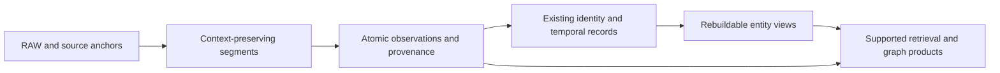
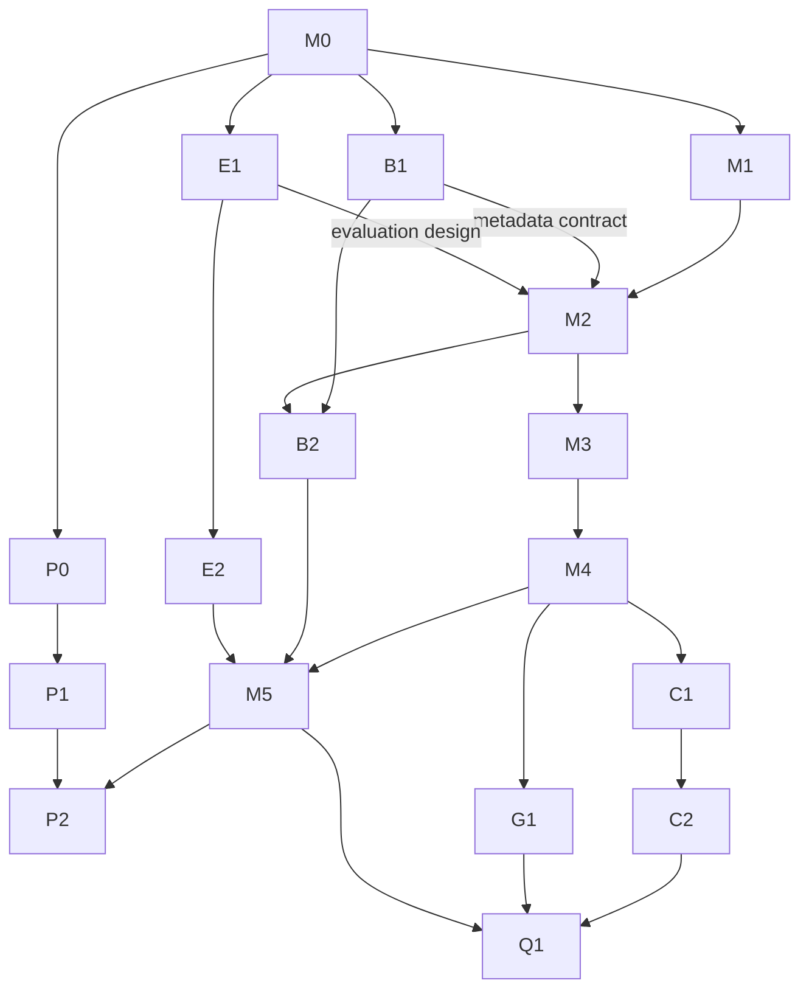

# Memory formation and temporal entity aggregation roadmap

**Decision record:** HISTORY#645, 2026-09-12.

**Stage:** M1 diagnostic evidence accepted for design; M2's first-slice contract
is frozen below. M3 is implemented and locally verified as an opt-in candidate;
protected merge and cumulative PR acceptance remain separate. See HISTORY#655.

**September 14 provider correction:** the operator's roughly $50 is on
Claude.ai, not the API Console. E1 now uses the supported Claude Code
subscription route described in [Claude Code benchmarks](../CLAUDE_CODE_BENCHMARKS.md).
This supersedes the earlier direct-API funding assumption in R05/E1.
The M1 audit and probe have been copied into draft PR #269 independently of
PR #264's website publisher. September 19 review supports the retained
synthetic findings and identified gaps in the new verification suite; the
current repair and disposition are recorded in HISTORY#654 and the current
handoff. New tests do not retroactively prove the helper's original test-first
development. B1 and E1 design candidates exist on PR #269; the bounded M2
decision below accepts their applicable diagnostic inputs, while recording
the unresolved paid-evaluation contract separately.

**Owner:** root integration agent, with bounded stream owners assigned per slice.

This is the detailed execution specification for the operator's new SEAM
roadmap. [Root ROADMAP.md](../../ROADMAP.md) remains the authored registry and
its `roadmap:track:MemoryFormation` marker routes here. When the operator asks
**“what's next?”**, read the current handoff, this document's ready set and
stream dependencies, then verify live evidence before choosing work. Update
this document as decisions are resolved; record each material transition in
append-only HISTORY with `supersedes`. The derived roadmap state is an index,
not a replacement for these acceptance conditions.

The direction came from the operator-confirmed **Chunking Strategy Proposal**
conversation, recovered on September 12. The hypothesis is that memory
formation loses useful context before downstream graph/retrieval mechanisms
can use it. It is **not a demonstrated current root cause**. The first task is
to audit current behavior and historical evidence, then design a bounded
change. This takes priority over the previous surface-first score-campaign
sequence. Existing SEAM/MIRL contracts and S9/S10 qualification still apply.

## Request register

These requirements preserve the whole recovered direction. Later ideas must
not displace the opening chunking and temporal-entity priorities.

| ID | Operator requirement | Execution home |
| --- | --- | --- |
| R01 | Improve chunking/memory formation; consolidate entity observations through a temporal chain using available context and metadata | M1-M4 |
| R02 | Audit active code, Git history, prior experiments and measured results before declaring the diagnosis established | M1 |
| R03 | Produce a feasible detailed plan before implementation, then test, benchmark and qualify deployment | M0-M5, Q1 |
| R04 | Develop BIL-3 alongside memory formation; BIL-2 is useful but insufficient for the requested reproducibility scope | B1-B2 |
| R05 | Configure Claude benchmarking using the funded Claude.ai account; September 14 clarification supersedes the initial direct-API/$72 assumption with roughly $50 Claude.ai balance | E1-E2 |
| R06 | Keep Canticle's website current with benchmark/test reporting | P2 |
| R07 | Find and use the existing consolidated report/data home; categorize benchmarks, tests and metadata; retain superseded evidence | P0 |
| R08 | Create Canticle-styled research papers and separate benchmark/test reports, including predictions, actual outcomes and failures | P1-P2 |
| R09 | Keep the complete direction together in a detailed repo handoff usable on the G7 | M0, canonical handoff chain |
| R10 | Make SEAM a foundational AI memory/reasoning dependency | C1, Q1; product direction, not an adoption claim |
| R11 | Include Sleep for offline/deep consolidation and Daydream for lightweight online consolidation tied to formation | C1-C2 |
| R12 | Plug-and-play installation and mostly automatic operation, with explicit manual memory commands and operator control | C2, Q1 |
| R13 | Knowledge/reasoning graphs and their visual experience remain central product value | G1, Q1 |
| R14 | Keep initial memory-formation priorities dominant; proceed carefully with setup and dependency-aware parallel work | This ready set and dependency model |

The conversation's **beyond 80%** aspiration is not an acceptance threshold.
The older launch plan's 90% aspiration does not silently replace it. Select a
benchmark, metric, split, answerer/judge, context budget, comparator and cost
protocol in E1 before attaching a score target to either. Retrieval recall and
answer quality are separate measurements; no result is promised.

## Current ready set

| Order | Work | Status and exit |
| --- | --- | --- |
| 1 | M0: register roadmap, current handoff, PR dispositions and durable routing | Merged through PR #261 |
| 2 | M1: current ingestion and temporal-identity audit | Diagnostic findings accepted for M2 after independent review and HISTORY#654 repair; original helper TDD and cumulative PR release qualification remain separate |
| Parallel with M1 | B1: BIL-3 schema design; E1: provider/evaluation setup; P0: report-home discovery | B1 and E1 design candidates on PR #269; review independently of M1 and provider connectivity |
| After M1 and design inputs | M2: architecture decision and acceptance fixtures | First-slice contract frozen below; executable M3 examples are developed at the named public interfaces |
| After M2 | M3: context-preserving segmentation; M4: temporal entity projection | M3 implemented and locally verified as an opt-in candidate; protected merge remains open. M4 consumes the contract and validated M3 output and remains unimplemented |
| After M3/M4 | M5: integrated baseline/candidate evaluation | Requires E1-E2 and B2; no default or production promotion from a free diagnostic |
| Later | C1-C2, G1, P2, Q1 | Contract sketches/report templates can proceed earlier as noted below; runtime adoption and claims depend on demonstrated formation behavior |

No worker is assigned merely by appearing in this table. Root dispatches
bounded packets, records actual owners and exact bases, and integrates one
reviewed slice at a time. “Ready” means dependencies permit starting; it does
not mean running, tested, merged, or deployed.

## Governing boundaries and proposed design

[SEAM_SPEC_V0.1](../../SEAM_SPEC_V0.1.md) and [MIRL v1](../MIRL_V1.md)
remain the governing product contracts. RAW and IR remain retained evidence;
PACK and graph/aggregate projections remain derived. Inspect existing
`compile_nl`, identity, lifecycle and source-selection interfaces before
selecting changes. Reuse their authority boundaries instead of creating a
second entity registry or a mutable aggregate that replaces original records.

Proposed data flow, subject to M1/M2 evidence:

M2 must resolve these design questions with concrete examples and public
interface tests before runtime implementation:

| Concern | Required decision / invariant |
| --- | --- |
| Segmentation | Define speaker, time, event/entity and discourse-boundary signals; bounded token/size fallback; overlapping context policy; deterministic versioned output. Increasing chunk size alone is not the proposed solution. |
| Evidence | Every emitted observation/view links back to original RAW/SPAN evidence and the context needed to interpret it. Preserve speaker attribution and source timestamps; do not synthesize missing dates. |
| Atomicity | Preserve distinct propositions and events. Context-rich containers may group them but cannot erase their independent evidence or merge repeated events into one by text similarity alone. |
| Identity | Audit current exact-label coreference, alias admission, reversibility and scope. Ambiguous names remain unresolved; cross-tenant or unsupported same-name merges are forbidden. |
| Time | Distinguish event time, observation time and ingestion time where the contract supports them; retain unknowns and competing states. Define as-of queries and state transitions without flattening history to the latest text. |
| Contradiction | Preserve conflicting claims and their provenance; a later statement does not automatically erase an earlier valid interval or establish truth. |
| Lifecycle | Corrections, deletion, supersession, isolation and restoration follow current canonical rules. Rebuilds and caches must not resurrect excluded content. |
| Derived views | Rebuild from retained source records with version, contributing IDs, scope and invalidation rules. Define what is persisted, what is cached, and how replay is idempotent. |
| Integration | Keep the supported ingestion/retrieval seams and current compatibility defaults. Candidate formation must be selectable and observable before any default change. |
| Migration | Name re-ingest/rebuild requirements, old/new coexistence, cost, rollback and exact promotion decision; do not silently mutate a user's database. |

The prior chat proposed `temporal-entity/1` as an illustrative policy name.
It is not registered or implemented. The first-slice decision below freezes
only its explicitly named segmentation limit and Python interface; it does
not freeze a temporal wire format, database schema or retrieval policy.

## M2 first-slice decision: context-segments/1

Frozen on September 20 UTC, September 19 operator-local, before candidate
measurements. The independent architecture review accepts M1's narrow
synthetic observations and counterexamples as sufficient design evidence.
It does not accept the whole mixed PR, retroactively establish the original
probe's test-first history, or establish a retrieval/answer-quality result.
The original observations remain immutable.

**Accepted inputs.** B1's [formation metadata contract](../BIL_3_SPEC.md#8-formation-metadata-contract-m2-consumes-this)
names the diagnostic fields. E1 supplies fixed retrieval settings, separate
freshly ingested arms, uncertainty controls, scoreboard separation and a locked
holdout. Its paid campaign is not ready: the same-model answerer/judge in
E1 section 4 must be reconciled with the operator's independent-review
requirement, and no completed pre-candidate answer-quality baseline exists.
Neither missing paid evidence nor provider funding blocks this explicitly
provider-free mechanism implementation. Before paid benchmarks, notify the
operator and agree exact model roles, call counts, caps and stop conditions;
OpenAI, DeepSeek and possibly Grok are funding options, not selected models.

**Baseline.** A fresh M1 diagnostic probe completed on clean `93eafed` before
runtime edits. Its external observations have SHA-256
`98696aa953114ccfb1cbe6608bb7c24249226dcfe08ac97f50ee1fdb71b2b5db`.
This is a mechanism baseline, not an E1 judged baseline. The original tracked
M1 fixture and baseline compiler regression suites remain unchanged controls.

### Interfaces and records

The existing Python `compile_nl`, `SeamRuntime.compile_nl`,
`ingest_conversation_turn` and `ingest_text` interfaces gain keyword-only
`formation_policy="baseline"` and `max_segment_chars=1024`. The explicit
candidate policy is `context-segments/1`; baseline remains the default.
Unknown policies and invalid candidate bounds fail before persistence. This creates
no new HTTP, CLI, storage schema or retrieval-policy contract.

The separate `seam_runtime/formation.py` segmenter preserves original Unicode
code-point offsets. Existing `segment_propositions` remains unchanged because
grounded extraction validates against its legacy boundaries. Candidate
formation initially rejects rich extractors, derived-fact policies and enabled
environment extraction/regex enrichment rather than silently combining
unqualified grounding contracts.

Boundaries recognize newlines, ASCII sentence endings, Unicode `。！？`,
decimal exclusions and a small versioned abbreviation set (`Dr.`, `Mr.`,
`Mrs.`, `Ms.`, `Prof.`, `e.g.`, `i.e.`). The hard fallback prefers whitespace,
then splits exact character ranges when a word exceeds the bound. There is
no overlap and no generated source prefix. The 1,024-character default is a
resource limit frozen for this slice, not a measured token optimum or latency
guarantee. Whitespace/separators remain verbatim in RAW. Empty and nonlexical
input reports its actual zero emitted segments.

Each admitted segment emits an exact SPAN and content claim with canonical
provenance. Unicode-only text receives a source-grounded lexical fallback;
its preservation does not imply language-specific entity recognition.
Context offsets refer into original RAW, never to reconstructed text. A hard
split retains its complete parent proposition/context range, including a
condition or reported-speech qualifier outside the bounded fragment. Speaker
evidence has an exact source range as well. A continuation fragment is not
reinterpreted as a new independent speaker assertion. The character bound
applies to the emitted SPAN; a context range is an offset reference and may
cover a larger retained source region.
Extensions contain offsets rather than record IDs, because the current
ingestion namespace adapter does not rewrite extension references.

### Attribution, time, identity and lifecycle

Supplied speaker/time metadata is usable independently of extractor selection
only when it matches the exact source envelope. Line-start colon speakers
define local contexts. Mismatched explicitly supplied metadata rejects the
candidate before persistence with a content-free error; absent metadata is
valid and does not acquire an invented speaker or timestamp.
Unquoted singular first-person statements may bind to
that grounded speaker; an explicit statement about Bob inside Alice's turn
retains Bob as its subject. Quoted or ambiguous attribution stays unresolved.
Automatic binding is limited to an unambiguous `I` subject (including ordinary
contractions). `My dog` and `My sister` retain their lexical subjects; ownership
does not make the speaker the subject. A bare possessive such as `Mine` stays
unresolved. Quote handling distinguishes nested delimiters and apostrophes.
Observation timestamps are preserved as supplied; relative event time is not
inferred, and missing time remains unknown. No event intervals or truth
resolution are introduced in M3.

The caller's `source_ref` supplies event identity. Distinct references preserve
distinct repeated events; replay of the same reference/content is stable;
changed content at the same reference follows existing correction and
supersession semantics. Candidate compiler identity includes policy, bound,
source reference, supplied source-envelope inputs and existing boundary salt.
Envelope presence matters because it can change attribution and which header
characters are interpreted as context. No second entity registry is
introduced. Candidate document identity also includes the formation
configuration. Switching policy or bound creates a distinct generation and
uses the existing atomic same-source supersession transaction; it does not
overwrite the old generation in place. Concurrent different-policy writers
follow last-committed-generation semantics, not a cross-process refusal
guarantee. Matched arms use fresh stores. Native-loader
dialogue IDs and separate caption envelopes remain a named follow-up, so this
slice cannot claim to repair metadata never delivered to the compiler.

Existing lifecycle exclusion, scope isolation, source supersession and graph
rebuild rules remain authoritative. M3 verifies that candidate records survive
restart/replay and obey those rules. M4 will implement temporal entity views,
contradiction interpretation and derived-view invalidation. Rollback selects
baseline in a fresh store and re-ingests retained sources; no automatic
migration or default promotion occurs.

### Observable diagnostics

Candidate RAW extensions and ingestion document metadata carry matching
`formation` diagnostics under `seam-formation-diagnostics/1`, with
`version="formation/1"` and `segmentation_policy="context-segments/1"`:
actual segment count, character size
summary, boundary-signal counts, exact source-anchor coverage, attribution and
timestamp preservation fractions, compilation outcome and unavailable-field
reasons. Source text and speaker labels do not appear in these diagnostics.
Zero-denominator coverage is null, never a perfect score. Timestamp synthesis
is zero. Token-size measurement is unavailable until a named tokenizer is
measured; entity-view version and contradiction interpretation remain
unavailable until M4. Re-ingestion requirements describe this policy and do
not attest that a benchmark actually re-ingested its corpus. The legacy
document `chunk_count` remains compatible and must not be read as proposition
coverage.

Coverage and preservation fields carry explicit numerators, denominators and
a `fraction`, so absence cannot masquerade as full coverage. `segment_size`
contains configured character bound and observed total/minimum/maximum plus
an explicit unavailable token measurement. B1 collectors consume these named
fields; this diagnostic payload is not itself a signed BIL-3 bundle.

### Frozen examples and ownership

Sol owns `seam_runtime/formation.py`, the two existing compiler/runtime files,
and `tests/audit/test_memory_formation_m3.py`. Root owns this decision and
continuity; independent Astra review checks the implementation and evidence.
Tests exercise public compiler, ingestion and canonical store interfaces.

| Example | Expected M3 behavior | Later M4 obligation |
| --- | --- | --- |
| `東京が好きです。大阪に住んでいます。` | Two exact spans/content claims; RAW unchanged | No inferred entity or location claim |
| `Dr. Chen moved to Oslo. She works there.` | Two segments; abbreviation retained | Pronoun resolution remains unresolved |
| `Value is 4.2. Next value is 5.` | Decimal retained inside first of two spans | None |
| `Alice: I like tea` newline `Bob: I like coffee` | Separate local speaker contexts and grounded subjects | No unsupported identity merge |
| Matched `[Alice 2026-09-01]` plus `I moved. Bob stayed.` | Alice for first person; Bob for explicit third person; exact timestamp retained | Event time differs from observation time |
| Quoted `"I moved"` in Alice's turn; mismatched supplied envelope | No automatic quoted-person binding; malformed metadata fails closed | Resolve attribution only with further evidence |
| Long spaced/unbroken/Unicode text, including `If Bob agrees, I will move.` | Every span within bound, exact offsets, no duplicated text; fragments retain full conditional parent context | Measure downstream usefulness separately |
| Empty or punctuation-only text | Verbatim RAW, zero segments and null coverage denominator | None |
| Same text with two source references; repeated same reference | Two source events; idempotent replay within each event | Distinct-event temporal projection |
| Same reference with corrected text; deletion; restart; second scope | Existing supersession/exclusion; exact anchors after reopen; isolated scopes | Derived temporal view invalidation/rebuild |
| Relative time, ambiguous names, changed residence, conflicting claims | Original wording/evidence retained independently | Unknown dates, transitions, contradictions and as-of views |

M3 acceptance requires witnessed red/green behavior tests, baseline/fidelity,
conversation, source-dedup and affected audit regressions, independent review,
continuity, exact-head required CI and protected merge. Free mechanism
conformance is reported separately from latency, retrieval and answer quality.
No holdout is read or tuned during this slice. M5 still requires the separately
resolved evaluation protocol, B2 and M4; no hypothesis is promoted from a
passing mechanism test alone.

## Work stream specifications

### M0-M2 — preparation, evidence and design

**M0 — continuity and queue reconciliation.** Root owns root roadmap markers,
status/ledger routing, handoff registry and HISTORY. Preserve unrelated dirty
work and reconcile live PRs. Exit: registered single current handoff, coherent
roadmap pointers, verified derived streams, independent review, required
checks and protected merge. This does not complete runtime implementation.

**M1 — formation audit.** Own a dated tracked audit under `docs/audits/`,
registered in its index with an Evidence manifest. Trace real inputs from
adapter through `compile_nl`/extractors to persisted source/IR, identity and
graph products, then supported retrieval. Starting paths:
`seam_runtime/{runtime,nl,nl_extract,identity_resolution,knowledge_graph,graph_products,graph_source_selector}.py`
and `benchmarks/external/locomo/{adapters/seam,ingest_only}.py`.
Inspect relevant current tests rather than assuming old audits describe main.
Build a matrix of available metadata, fields consumed/preserved/lost, source
anchors, entity/time/contradiction behavior, and exact file/function evidence.
For each alleged loss, retain a minimal reproducible input and observed output
at a named SHA. A negative storage claim needs a targeted text-column check
validated against known-present evidence.

Read the versioned KB before designing experiments:
[benchmark traps](../kb/eval-methodology/benchmark-traps.md),
[LoCoMo/Mem0 harness](../kb/eval-methodology/locomo-mem0-harness.md), and
[lever graveyard](../kb/seam-internals/lever-graveyard.md).
Use bounded topic/history packs for follow-ups. The June 15 entity-aggregation
audit predates later identity work; its default-off retrieval-time string
aggregation and negative answer-quality evidence cannot prove today's ingest
bug. Existing `entity_agg`, dossier/decomposition and identity-fold results
must be accounted for before proposing anything similar. Exit: confirmed
mechanism gaps, counterexamples, historical non-wins, and a narrow M2 proposal;
if the hypothesis is disproved, record that result and revise the plan.

**M2 — design freeze for the first slice.** Requires M1 findings, B1's agreed
formation metadata fields and E1's evaluation design. E1 credential/provider
access and P0 report-home discovery are independent of this design gate.
Own a focused decision section in
this roadmap plus fixtures in existing test homes. Select the smallest public
interface change supported by M1. Define segment/observation/entity-view
contracts, ownership, bounds, replay, lifecycle, temporal behavior, diagnostics
and rollback. Fixtures must cover speaker changes, ambiguous entities, relative
time, repeated events, state changes, contradictions, correction/deletion,
restart/rebuild and scope isolation. Exit: reviewed examples and expected
outputs, exact implementation/test paths and a bounded baseline/candidate
protocol. Do not tune against a locked holdout or choose only known misses.

### M3-M5 — formation and measured validation

**M3 — segmentation implementation.** Own only the agreed ingestion/compiler
slice and its public-seam tests. Establish witnessed failing behavior tests,
implement and record green outcomes. Preserve baseline mode, emit versioned
formation diagnostics without secret/raw-trace leakage, and demonstrate
stable source anchors and replay. Exit: the M3-owned segmentation/source-anchor
subset of M2 fixtures passes, direct
regression suite and applicable audit tests pass, independent assurance,
continuity and protected merge. Performance bounds are defined from M1/E1
measurements, not invented after seeing the candidate.

**M4 — temporal entity aggregation.** Start interface work after M2; integrate
only after M3's output contract is proven. Reuse existing identity admission
and lifecycle semantics. Build bounded, rebuildable entity views with source
membership, time transitions, relationships and visible contradictions.
Demonstrate current/as-of behavior, invalidation, restart, replay and deletion
without losing original observations. M4 owns the remaining M2 entity-view,
temporal, contradiction and derived-lifecycle fixtures. Exit: those mechanism
fixtures pass and a
baseline/candidate evidence comparison shows exactly what context is gained
or lost. Retrieval weights remain fixed for this causal comparison.

**M5 — integrated evaluation.** Depends on M3, M4, E1/E2 and B2. Separate free
coverage/formation diagnostics from judged answer quality. Run baseline and
candidate under matched dataset/split, answerer/judge, retrieval settings and
context budgets; include unchanged cases, failures and variance/no-change
controls. Record ingest cost/time, storage growth, retrieval latency,
provenance coverage, temporal/contradiction/lifecycle outcomes and per-case
answer deltas. Frozen-context and fresh-reingest experiments answer different
questions and must have separate labels. Exit: reproducible evidence and a
recorded promote/revise/reject decision. A recall increase alone does not
qualify an answer-quality win or default promotion.

### B1-B2 — BIL-3 reproducibility

**B1 — schema and compatibility design.** Can run beside M1. Inspect
`seam_runtime/benchmark_integrity.py`, current BIL docs, bundle signing,
verification and publishing before specifying a successor. Current supported
levels on the audited base are BIL-0/1/2; preserve verification of prior bundles.
The proposed name is **BIL-3: Signed Reproducibility Bundle**. Define required,
optional, unavailable and unsupported fields explicitly; a missing field is
not a successful attestation.

Candidate manifest sections: CPU/GPU/RAM; OS/kernel/architecture;
Python/runtime and dependency/lock hashes; exact Git SHA and dirty-state policy;
DB/backend and vector/index configuration; embedding identity/version/hash;
answerer/judge identity/version and seeds; retrieval policy/leg weights;
context budget/top-k; segmentation/ingest/entity-resolution contract versions;
dataset/fixture hashes; sanitized configuration fingerprints; results and
per-case artifact hashes. Define canonical serialization, full-manifest
signature coverage, trust/key identification, deterministic verification,
redaction, schema versioning and compatibility. Never fingerprint raw secret
values into a public manifest. Signatures prove artifact integrity/identity,
not correctness of the measured claim.

**B2 — implementation and verification.** Depends on B1 and M2's formation
metadata contract. Existing BIL-2 reader/publisher behavior remains compatible
unless an explicit migration decision changes it. Add positive and tamper,
missing-evidence, unavailable-hardware and cross-platform verification cases.
Exercise round-trip/offline verification with a local fixture first. Exit:
exact bundle can be independently verified, modified evidence is rejected,
legacy bundles still follow their documented semantics, and collector errors
are represented honestly. No BIL-3 label before the implementation and evidence
meet the adopted specification.

### E1-E2 — provider and benchmark setup

**E1 — campaign contract and credentials.** Can run beside M1 without paid
execution. Inspect current runner/provider interfaces and installed CLI help;
verify Claude Code subscription support, chosen model roles and cost accounting.
The operator clarified that the available roughly $50 is on Claude.ai;
an inherited API key is not the intended billing source and must not be used.
Use the supported CLI login, never copy OAuth credentials into API requests,
and keep all credentials outside tracked artifacts. Establish accessible
models, budget and billing source. Record a bounded smoke limit, per-run and campaign ceiling, retries,
abort criteria and spend receipt routing before calls. If provider balance
cannot be queried, say so and use an explicit conservative cap from available
operator evidence rather than inventing a balance.

Freeze dataset version/hash, split and holdout, baseline SHA/config,
answerer/judge protocol, comparator pin, context/token budget, metrics and
uncertainty procedure. Claude Code subscription experiments are a named separate lane
when they differ from published Mem0 answerer/judge conditions. Do not compare
that lane to a published scoreboard as if conditions matched. Keep strict
native and incumbent-relative judge scoreboards separate. PR #249's proposed
Mem0 beta must not silently change the benchmark baseline.

**E2 — bounded provider/harness smoke.** Depends on E1's documented limits.
Run the smallest useful authorized smoke and inspect real response, model,
usage/retry records, failure propagation and saved configuration. Reconcile
actual spend including aborted/retried calls; artifact totals may be lower
bounds. Exit: provider and runner work with auditable costs, credentials stay
private, and the bounded M5 campaign is executable. No paid call was performed
as part of creating this roadmap.

### P0-P2 — records and Canticle reporting

**P0 — locate existing report home.** Can run beside M1. Follow
[Reports and Evidence](../REPORTS_AND_EVIDENCE.md): tracked interpreted reports
in `docs/audits/`, machine bundles in `benchmarks/runs/`, verified claims in
`benchmarks/RESULTS.md`, testing notes in `tests/docs/`, rich private/raw
artifacts in configured external storage. The existing storage script defaults
to `Documents/SEAM/benchmarks`; that is a code default, not proof this is the
operator's remembered folder. Inspect the current configured destination and
nearby relevant directories before choosing a home. Exit: confirmed location,
benchmark/test/metadata classification, retention/supersession, evidence hashes
and cross-repo publication routing without duplicating a second source of truth.

**P1 — report templates.** Depends on P0's routing; can run before results.
Use applicable Canticle writing/design skills when producing artifacts.
Research papers need question/background, related work, methods, evidence,
limitations and interpretation. Benchmark/test reports need exact run identity,
hypothesis/prediction, changes, environment, data, outcomes, failures,
predicted-versus-observed differences and reproducibility links. Distinguish
unrun templates from actual studies. Exit: two reusable Canticle-styled forms,
with supersession and evidence sections reviewed against a real existing run.

**P2 — website reporting.** Depends on P1 and verified run/study artifacts;
coordinate through the Canticle website repository's policy. Record source
report/hash, public-data review, render preview and actual publication receipt.
Agree a practical update cadence based on completed runs and material findings;
automation should publish only qualified content. A SEAM docs merge alone is
not a website deployment. Retain failed/negative results and older revisions.

### C1-C2, G1, Q1 — consolidation and product delivery

**C1 — Sleep/Daydream contracts.** Contract sketches may proceed after M2;
implementation follows M4 evidence. Sleep is offline/deeper consolidation;
Daydream is online/lightweight consolidation in available moments. Specify
scheduling, bounded CPU/memory/provider budgets, cancellation, checkpoints,
replay, isolation, provenance and operator enable/disable/manual controls.
Neither mode may silently rewrite canonical evidence or assert inferred facts
as observations. Existing Codex session-learning `/sleep` work is tooling,
not implementation of either SEAM runtime concept.

**C2 — controlled automation.** Depends on C1 and proven M4 behavior. Expose
simple install/default operation and explicit “remember this”/manual overrides
through existing supported surfaces. Test interruption/restart, idle-budget
contention, disabled mode, rejected operations and actual backend receipts.
Autopilot must not conceal failures, cost or state changes.

**G1 — graph experience.** Depends on the M4 view contract; visual/interface
sketches can run alongside C1. Feed knowledge/reasoning products with real
formation data and inspectable evidence, time and disagreement. Reuse the
existing surface/graph plans and demonstrate operator navigation from a view
to its sources. Recorded reasoning means inspectable stored decisions/evidence,
not invented access to a model's hidden reasoning. Test useful empty/error
states and lifecycle changes; preserve the graph visual experience as a core
product requirement.

**Q1 — qualification and delivery.** Depends on M5's accepted result and the
specific C/G capabilities offered. Track S retains S9 Promotion and S10
release/deployment gates. Maintain R2/S8 compatibility baseline and regression
gates. Follow the existing Suite/API/private-SDK boundaries, operator
acceptance, artifact eligibility, TestPyPI and production publication decisions.
Exit: independently qualified exact candidate, migration/rollback proof and
actual release/deployment receipts for the offered product. Publication and
hosted readiness remain distinct from code merge.

## Dependency and parallel-work rules

Root alone integrates shared roadmap/status/HISTORY/registry changes. Separate
workers may own M1 audit, B1 BIL design, E1 harness setup and P0 storage mapping
concurrently; they return evidence and proposed edits, not competing timeline
heads. M3 and B2 can implement independently once M2 freezes their shared
metadata interface. M4 must not guess M3 outputs; website templates can precede
results but public claims cannot. Delay speculative UI/consolidation work if
it consumes the attention needed to finish the opening formation investigation.

Each slice records: input SHA and predecessor HISTORY refs; owner/path scope;
decision and rationale; output artifacts/hashes; actual verification and
failures; review disposition; exact PR head/merge receipt; next unresolved
step. Append a successor HISTORY entry and regenerate derived views at each
material state transition. Never overwrite old evidence to tidy the temporal
chain or mark a whole stream complete from one successful fixture.

## First continuation packet

Continue the frozen M2 decision with **M3** implementation and verification,
then M4's temporal/entity contract. Do not repeat the completed M1 diagnostic
audit or treat its acceptance as cumulative PR qualification. Resolve the paid
E1 review protocol and benchmark baseline separately before M5; provider
funding and P0 discovery remain independent. The current handoff carries exact
recovery context, PR heads/dispositions and preserved worktrees.
