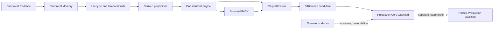
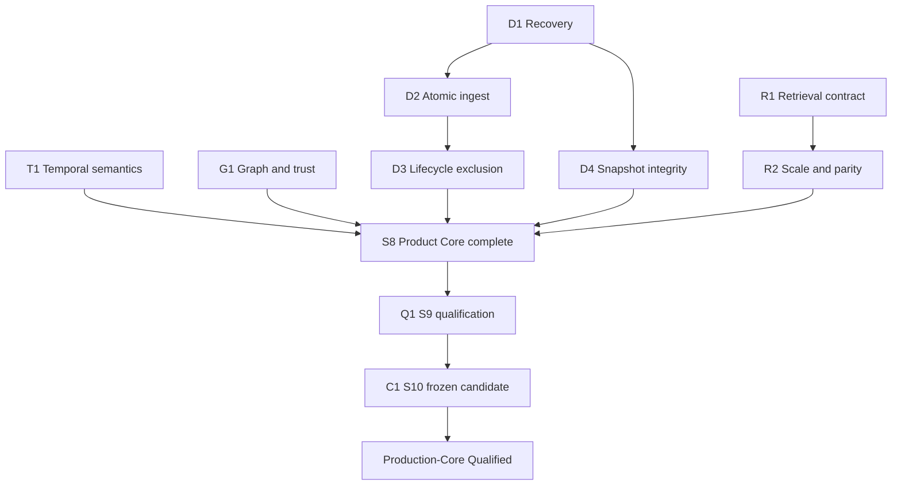

# Track S S8-S10 Production-Core Completion Specification

[Back to SEAM roadmaps](README.md)

**Status:** active execution specification
**Protected baseline:** `main@a408ec3`
**Governing contracts:** [SEAM specification](../../SEAM_SPEC_V0.1.md),
[MIRL v1](../MIRL_V1.md), and the
[Track S campaign](MEMORY_GUARANTEES_CAMPAIGN.md)
**Execution boundary:** provider-free by default, fail-closed, test-driven,
and limited to the Product Core defined in [the domain language](../../CONTEXT.md)

## Decision

Complete S8-S10 as one evidence chain over a frozen Product Core. Do not use
operator-surface work to hide or postpone durability, lifecycle, transaction,
retrieval, graph, qualification, or release defects. The TUI, benchmark UI,
graph dashboards, WebUI, and HTTP/public presentation layer are deferred and
cannot establish or block Product Core correctness unless an already-published
Track S invariant specifically depends on them.

This specification consolidates:

- the original S0-S10 dependency graph activated at HISTORY#511;
- the protected S8 mechanism slice published through HISTORY#605-#607 and PR
  #228;
- the current S8-next direction in the protected handoff chain;
- the governing RAW -> MIRL -> derived projection -> PACK architecture; and
- the product-functionality findings independently rechecked from the recovered
  2026-08-29 full-repository audit candidate.

The audit is intake evidence, not a replacement specification. A finding enters
this plan only when it conflicts with a governing invariant and is reproduced
against the protected baseline.

The recovered Claude audit remains an unpublished local candidate in its
original checkout and is deliberately not imported here: its report/index/
handoff set was unfinished and some publication-level evidence statements did
not survive verification. The table below preserves only independently
reproduced Product Core conflicts and routes them to governing tests.

## Completion claim

Track S completion means **Production-Core Qualified**, not Hosted-Production
Qualified. A future operator/deployment stream must prove the concrete service
topology before SEAM can claim hosted production.

## Non-negotiable product invariants

1. **Canonical ownership.** RAW and MIRL are canonical. Vector indexes, graph
   topology/products, retrieval events, compiled knowledge, and PACK are
   derived or append-only evidence, never substitute truth.
2. **One retrieval engine.** Every compatibility path delegates to one
   `SeamRuntime.retrieve()` policy engine. A legacy scorer may exist only as a
   versioned adapter inside that engine.
3. **One committed ingest outcome.** Canonical records, supersession, document
   status, lifecycle state, and durable projection intent become visible as one
   outcome or not at all.
4. **One committed retrieval view.** Every SQLite-backed leg and visibility
   check in a retrieval observes one committed snapshot. A failed write cannot
   silently terminate that snapshot.
5. **Lifecycle exclusion is transitive.** Once a memory is soft-deleted,
   ordinary trace, graph product, retrieval, PACK, identity, and projection
   reads cannot expose its content. Retention at rest is not Physical Erasure.
6. **Recovery is exclusive and fail-closed.** Restore, migration, rebuild, and
   cleanup cannot cross a live supported store user. A failed recovery leaves
   the old state valid or the new state valid, never an undetectable mixture.
7. **Derived state converges.** A crash before or after projection work is
   recoverable from canonical state and durable intent without resurrection.
8. **Temporal and trust decisions are deterministic.** Equivalent timestamps,
   boundary filters, ranks, and evidence produce one answer independent of
   parser path, adapter, backend, or process lifetime.
9. **Provenance is exact at admission.** Claims, relations, identities, graph
   products, and promoted reasoning retain exact evidence links; missing proof
   fails closed.
10. **Qualification does not promote.** Mechanism conformance, benchmark
    measurement, policy promotion, release, and hosted deployment are separate
    decisions with separate evidence.

## Agreed test seams

Tests describe behavior only through these interfaces. Internal helpers may be
rearranged without invalidating the contract.

| Seam | Product behavior observed | Test adapters |
| --- | --- | --- |
| `SeamRuntime` | compile, ingest, lifecycle, retrieve, PACK, convergence | temporary SQLite plus in-memory or local vector adapter |
| `SQLiteStore` and migration/recovery interface | canonical durability, snapshot, schema transition, backup/restore | temporary real SQLite files and subprocess crash probes |
| Lifecycle operation interface | plan/apply/recover, exclusion, idempotency | temporary canonical store plus derived-index adapter |
| Retrieval orchestrator interface | plan, leg execution, fusion, provenance, deterministic order | real SQLite legs plus explicit local vector adapters |
| Vector adapter interface | backend parity, ordering, divergence detection | SQLite, live external pgvector lane, Chroma smoke lane |
| Qualification and bundle interface | frozen arms, attribution, hashes, promotion refusal | provider-free fixtures and sealed local artifacts |
| Release verifier interface | artifact content, dependency bounds, install/upgrade/rollback proof | isolated wheel/sdist and clean temporary environments |

HTTP handlers, TUI widgets, browser state, dashboard routes, and visual graph
components are not test seams for this program.

## Audit intake and disposition

### Product defects admitted into the completion path

| Audit intake | Verified product conflict | Owning stream |
| --- | --- | --- |
| F-1, F-4 | Restore can cross a live store and the replace-before-sidecar sequence has a stale-WAL crash window. | D1 Recovery Boundary |
| F-5 | `ingest_text` exposes canonical records, supersession, and document status through separate commits. | D2 Atomic Ingest |
| F-2, F-3 | Soft-deleted content remains reachable through trace and graph-product reads. | D3 Lifecycle Exclusion |
| F-11 | Nine-table retention is factual, but becomes a defect only where it violates Lifecycle Exclusion or an explicit Physical Erasure request. | D3 plus a later retention contract |
| F-14 | A failed write can terminate a bound read snapshot. | D4 Snapshot Integrity |
| F-19 | Temporal comparisons differ across parser, lexical graph, and stale-horizon paths. | T1 Temporal Semantics |
| F-20, F-21, F-22, F-23 | Flag coercion, the boundary-only score gate, rank-base drift, and graph semantic seeding can change retrieval behavior by entry path. | R1 S8 Retrieval Contract |
| F-24, F-25, F-26 | Unevidenced disputes, dropped reasoning-pattern disagreement, and edges with filtered endpoints violate trust/provenance semantics. | G1 Graph and Trust Integrity |
| F-12, F-13, F-27, F-29 | Namespace-wide scans, pgvector plan mismatch, full-namespace materialization, and tie ordering threaten deterministic scale parity. | R2 Retrieval Scale and Backend Parity |
| F-35 | The exercised environment violates declared dependency ceilings while both existing checks pass. | C1 S10 Candidate Reproducibility |

### Qualified rather than treated as product defects

- Process-lifetime retrieval flags are deliberate run stability. S8 requires an
  explicit refresh/restart adoption contract, which is already published.
- Soft deletion retains canonical/audit evidence by design. It must satisfy
  Lifecycle Exclusion; Physical Erasure is a separate destructive operation.
- Legacy versus RRF default retirement is a Promotion decision. Keep the
  current default until S9 produces comparable evidence or the operator
  separately authorizes any paid requalification needed for the decision.
- Principal mode is core identity architecture already published by S6. HTTP
  presentation, rate limiting, and dashboard authentication are deferred here.

### Deferred operator or repository concerns

WebUI credentials/simulation, TUI provider behavior, static mounts, HTTP
limiting and security headers, MCP line framing, browser dashboards, benchmark
presentation, worktree/branch hygiene, and historical scanner coverage do not
enter these Product Core implementation streams. S10 may consume repository
and security gates as release evidence without turning their remediation into
Product Core code.

## Controlled TDD streams

Each stream is a vertical sequence: one failing behavior test, the smallest
passing implementation, affected tests, then review. Do not write a horizontal
batch of speculative tests.

### D1 - Recovery Boundary

**Goal:** a supported live canonical store and a byte-replacing recovery can
never coexist.

The accepted lock protocol is recorded in
[ADR 0001](../adr/0001-canonical-store-lifetime-lease.md).

1. Restore refuses while any supported `SQLiteStore` on the target is live.
2. The lease works across processes and multiple same-process stores.
3. Restore succeeds after every lease closes.
4. The old database and sidecars leave the active pathname before the restored
   database becomes the commit point.
5. Injected failure at every filesystem transition yields either the complete
   old state or complete backup state; reopen passes integrity/FK checks.

**Current branch evidence:** D1.1-D1.3 are implemented. The focused recovery
slice passes 78 tests, including parent-owned, child-owned, and inherited
refcount POSIX fork lifecycles. The complete 3,146-test non-external collection exits
zero with two expected xfails and no skips when routed to the existing pinned
model cache, and staged CodeRabbit review reports zero findings. D1.4 remains
open for the systematic filesystem-transition failure matrix; this stream and
S8 therefore remain incomplete.

### D2 - Atomic Ingest

**Dependency:** D1, so recovery remains trustworthy while transaction work
changes canonical writes.

1. Specify one `IngestOutcome` over records, supersession, document status, and
   durable vector intent.
2. Inject failure at each transition and observe either the previous document
   or the complete new outcome through `SeamRuntime`, never orphan live records.
3. Prove idempotent replay and concurrent same-source ingest.
4. Keep external vector work derived and recoverable through the outbox.

### D3 - Lifecycle Exclusion

**Dependency:** D2 for one canonical visibility transaction.

1. Soft-delete a record and assert absence through trace, graph products,
   retrieval, PACK, identity, and derived read interfaces.
2. Mark graph-product builds stale or rebuild them without rewriting canonical
   history.
3. Prove cleanup restart/idempotency and no deleted-record resurrection.
4. Specify Physical Erasure separately; do not silently reinterpret soft delete.

### D4 - Snapshot Integrity

1. A rejected write inside a read snapshot leaves the snapshot active.
2. Every later read in the request observes the original committed state.
3. Snapshot close owns the only rollback/end transition.

### T1 - Temporal Semantics

1. One timestamp parser and comparison policy owns `Z`, offsets, naive values,
   missing values, and invalid values.
2. Reconciliation, graph-as-of, stale horizon, and temporal retrieval share the
   same policy and fail-closed direction.
3. Equivalent instants produce identical truth and retrieval order.

### R1 - S8 Retrieval Contract

1. Resolve the boundary-only SQL gate by contract: two explicit boundary
   filters either admit the non-lexical tail at a named score or never do. The
   comment, score, and threshold must agree.
2. Make every approved flag settable and identical across default, persisted,
   environment, runtime, SDK, and compatibility entry paths.
3. Use one rank base and one deterministic final tie order across fusion
   implementations.
4. Make graph semantic seeding an explicit plan field, never a constructor
   default that varies by caller.
5. Retain legacy behavior as a versioned adapter until S9 Promotion evidence
   changes the default.

**S8 completion gate:** D1-D4, T1, R1, R2, and G1 are green; every original S8
mechanism exit remains green; the boundary-only SQL decision is recorded; and
the legacy default is either retained explicitly or promoted by S9 evidence.

### G1 - Graph and Trust Integrity

1. A contradiction can demote a claim only with admissible evidence.
2. A later conflicting reasoning-pattern outcome is retained as disagreement,
   not silently discarded.
3. Every returned graph edge has both endpoints in the returned node set under
   the same trust/time/boundary filters.
4. Exact evidence remains recoverable for every decision.

### R2 - Retrieval Scale and Backend Parity

**Dependency:** R1 correctness before optimization.

1. Bound compatibility and temporal candidate acquisition before Python
   materialization.
2. Make structured SQLite queries namespace-selective at scale.
3. Make pgvector query expressions match the admitted HNSW index contract.
4. Pin deterministic backend tie behavior.
5. Add fixed-slice growth budgets and SQLite/pgvector/Chroma parity cases.

### Q1 - S9 Qualification

**Dependency:** the frozen S8 completion commit.

1. Build one pristine ingest-only snapshot and clone every arm independently.
2. Run provider-free conformance, LoCoMo floor/category gates, and mechanism
   ablations with exact executed-leg traces.
3. Freeze and review a graph-eligible corpus before measuring graph lift.
4. Seal per-case quality, provenance, path, latency, memory, storage, failure,
   code/data/config hash, and uncertainty artifacts.
5. Mark unauthorized provider/comparator lanes `NOT_RUN`; never score them zero.
6. Produce a Promotion decision for each default-changing lever. A failed gate
   leaves the mechanism default-off or retains the legacy control.

### C1 - S10 Candidate Reproducibility

**Dependency:** all S8 and S9 evidence frozen at one commit.

1. Enforce installed versions against declared dependency bounds.
2. Pass strict non-external, live-pgvector external, migration, crash,
   lifecycle, temporal, semantic, retrieval, and parity suites with zero
   unapproved skips.
3. Build exactly one wheel and one sdist from the frozen commit; scan, hash,
   install hermetically, open historical stores, upgrade, roll back, restore,
   and replay derived state.
4. Prove clean-start and populated-store upgrade plus backup/restore and
   disaster-recovery drills using the same documented Recovery Boundary.
5. Make the stable full suite required only after repeated current-head proof.
6. Complete history, status, handoff, snapshot, routing, stream, wiki, secret,
   and exact-head review gates.
7. Keep publication separately authorized.

## Dependency and delivery graph

## Stream control and evidence packet

Every PR owns one stream or one inseparable vertical slice. Its history and PR
body must record:

- the stream ID and exact invariant;
- the public seam under test;
- the red command and failure;
- the green command and result;
- directly affected and regression suites;
- schema/projection/lock protocol changes;
- failure injection and byte/hash preservation evidence;
- excluded operator-surface work;
- remaining risks and the next dependency; and
- exact candidate commit, secret scan, continuity, and review boundary.

No stream closes from code review alone, no stage closes from focused tests
alone, and no benchmark result changes a default without a separate Promotion
decision.

## Immediate execution order

1. D1.1 live-store restore refusal (branch-local candidate complete).
2. D1.2 multi-process lease and post-close restore (branch-local candidate complete).
3. D1.3 stale-sidecar crash-safe restore commit point (branch-local candidate complete).
4. D1.4 systematic filesystem-transition failure matrix.
5. D2 atomic ingest.
6. D3 lifecycle exclusion across every Product Core read.
7. D4 and T1 correctness slices.
8. G1 and R1, followed by R2.
9. Freeze S8, run Q1, then freeze and qualify C1.

The first slice is intentionally small enough to review independently while
establishing the Recovery Boundary architecture used by every later stage.
